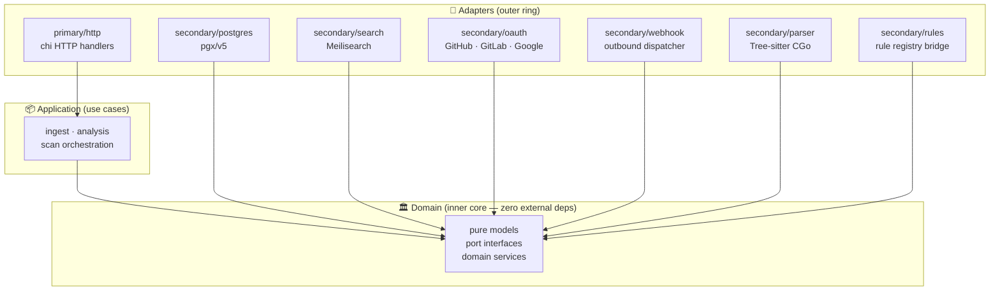
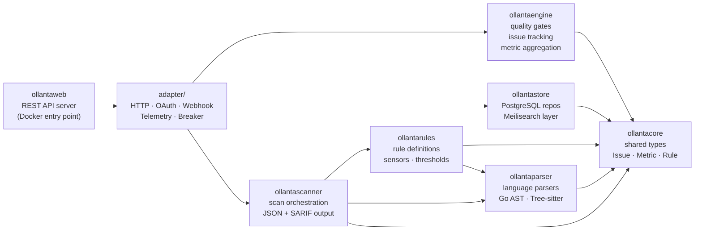
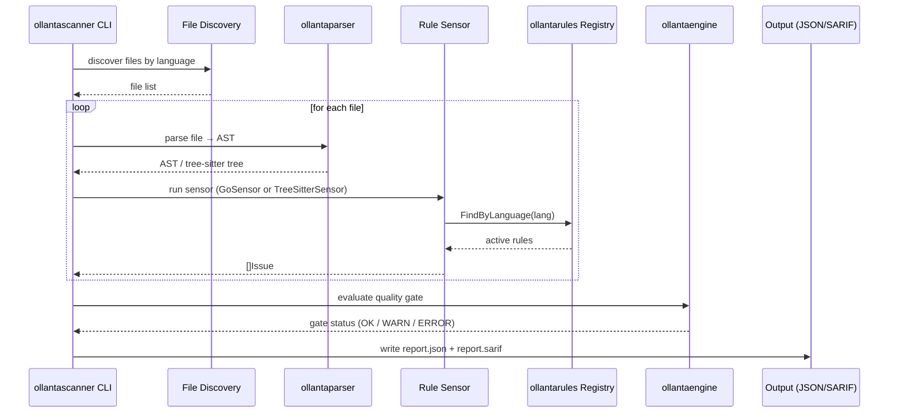
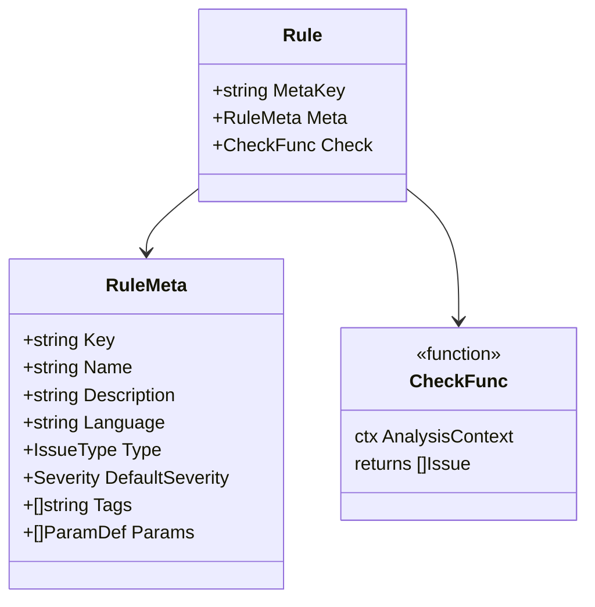
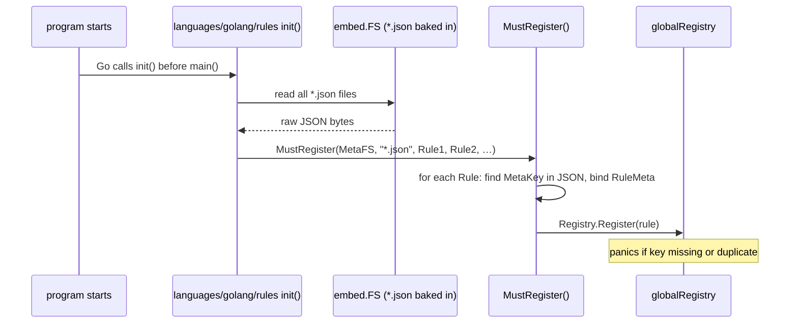
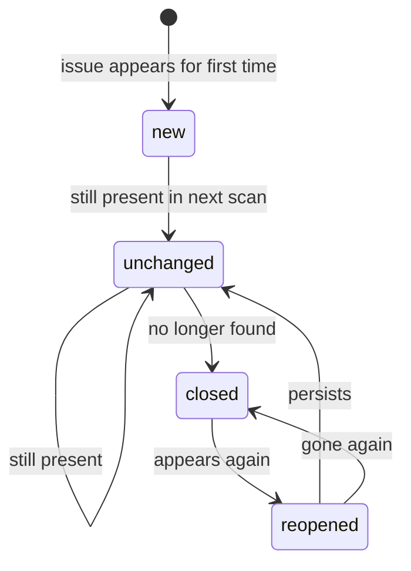

# Architecture

## Hexagonal Layout

Ollanta follows a **hexagonal (ports & adapters)** layout. The idea: the inner rings know nothing about the outer rings. HTTP, PostgreSQL, Meilisearch — all are plug-in details.

---

## Module Map

Each Go module has a single responsibility. Arrows mean "depends on".

---

## Scan Pipeline

What happens from the moment you run `ollanta -project-dir .` to seeing results:

---

## Rule System

Each rule is a struct with three fields:

**How rules load at startup** — the `init()` pattern:

---

## Issue Tracking

After each scan, `ollantaengine/tracking` compares results against the previous baseline:

Issues are matched first by **rule key + line hash** (content-based), then by **file path + line number** as a fallback. This means reformatting code without changing logic won't produce spurious closed/reopened transitions.
