# Ollanta Architecture

## What is Ollanta?

Ollanta is a multi-language static analysis platform designed to be fast, extensible, and easy to use. It reads your source code, applies a set of rules to detect problems (bugs, code smells, vulnerabilities), and generates detailed reports. Ollanta is inspired by tools like SonarQube, OpenStaticAnalyzer, and Semgrep, but was built from scratch with a modern, modular architecture.

It analyzes your code, understands its structure, and flags those problems automatically without executing anything — just by reading the source text (hence the term *static analysis*).

---

## Part 1: Overview

### The two sides of Ollanta

Ollanta has two halves that work together:

```mermaid
%%{init: {
  "theme": "base",
  "themeVariables": {
    "primaryColor": "#fef9c3",
    "primaryTextColor": "#1c1917",
    "primaryBorderColor": "#d97706",
    "lineColor": "#92400e",
    "secondaryColor": "#dbeafe",
    "tertiaryColor": "#f0fdf4",
    "edgeLabelBackground": "#fffbeb",
    "fontFamily": "ui-monospace, monospace",
    "fontSize": "14px",
    "clusterBkg": "#fffbeb",
    "clusterBorder": "#fbbf24"
  }
}}%%
graph LR
    subgraph SCAN ["  🔍  Scanner  "]
        A(["📁 Your code"]):::src
        B["🗂️ Discover\nfiles"]:::step
        C["🌳 Parse\neach file"]:::step
        D["📏 Apply\nrules"]:::step
        E["📄 Generate\nreport"]:::step
        A --> B --> C --> D --> E
    end

    E -- "📤 sends report" --> F

    subgraph SRV ["  🏢  Server  "]
        F["📥 Receive\nreport"]:::step
        G["🔄 Compare with\nprevious scan"]:::step
        H["🚦 Evaluate\nquality gate"]:::step
        I["💾 Persist\nto database"]:::step
        J(["🌐 API"]):::out
        F --> G --> H --> I --> J
    end

    classDef src  fill:#dbeafe,stroke:#3b82f6,stroke-width:2px,rx:12,color:#1e3a5f
    classDef step fill:#fef9c3,stroke:#d97706,stroke-width:2px,color:#1c1917
    classDef out  fill:#d1fae5,stroke:#059669,stroke-width:2px,rx:12,color:#064e3b

    style SCAN fill:#fffbeb,stroke:#fbbf24,stroke-width:2px,stroke-dasharray:6 3,rx:16
    style SRV  fill:#f0f9ff,stroke:#7dd3fc,stroke-width:2px,stroke-dasharray:6 3,rx:16
```

**The Scanner** analyzes your source code locally and produces a report with all found issues. It can run standalone in the terminal, generate a JSON/SARIF file, or open a local web UI to browse results.

**The Server** receives reports from multiple projects, stores scan history, tracks how issues evolve over time, and evaluates quality gates.

### Usage modes in practice

| Scenario | Command | What happens |
|----------|---------|--------------|
| "I want to see my code's issues right now" | `ollanta -project-dir . -serve` | Scanner runs, opens local UI on port 7777 |
| "I need a report for CI" | `ollanta -project-dir . -format sarif` | Scanner writes `.ollanta/report.sarif` |
| "I want centralized history" | `ollanta -project-dir . -server http://host:8080` | Scanner sends report to the server |
| "I want to query results via API" | `curl http://host:8080/api/v1/issues` | Server exposes data via REST |

---

## Part 2: How the Scanner works

When you run the scanner, four steps execute in sequence:

### Step 1: File Discovery

First, the scanner figures out *which* files to analyze. It walks the project directory recursively, looks at each file's extension, and decides the language:

```
.go     → Go
.js     → JavaScript
.mjs    → JavaScript
.ts     → TypeScript
.tsx    → TypeScript
.py     → Python
.rs     → Rust
```

The following directories are always ignored, regardless of configuration:

```
vendor/    node_modules/    .git/    testdata/    _build/    .ollanta/
```

To exclude additional files, use the `-exclusions` flag with comma-separated glob patterns:

```
ollanta -project-dir . -exclusions "*_test.go,generated/**"
```

> **Relevant code:** `ollantascanner/discovery/discovery.go`

---

### Step 2: Parsing

Source code is just text. To understand its structure, we need to transform it into a **syntax tree** — a representation that knows where each function, `if`, and variable begins. Ollanta uses **two different parsing strategies**:

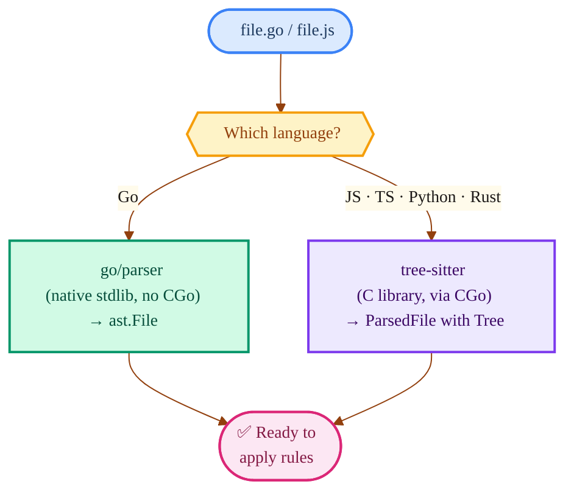

**Why two parsers?** Go ships an excellent parser in its standard library (`go/parser`). For other languages, we use [tree-sitter](https://tree-sitter.github.io/), a fast incremental parser that supports dozens of languages via pluggable grammars.

> **Important technical detail:** tree-sitter is written in C, so `ollantaparser` is the **only** module that requires CGo (a C compiler). All other Ollanta modules work without CGo, which simplifies builds and deploys.

> **Relevant code:** `ollantaparser/` (tree-sitter) and `ollantarules/languages/golang/sensor/` (native Go)

---

### Step 3: Rule Execution

With the syntax tree ready, the scanner applies **rules** — each rule knows how to detect one specific type of problem. For example:

- *"This function has more than 40 lines"* → rule `go:no-large-functions`
- *"This `==` should be `===`"* → rule `js:eqeqeq`
- *"Using a bare `except Exception:`"* → rule `py:broad-except`

Execution is **parallel**: the scanner distributes files across a worker pool (2× the number of CPUs) and each worker processes one file at a time. If a file causes a panic, the worker recovers and continues with the next one — a single bad file cannot take down the entire scan.

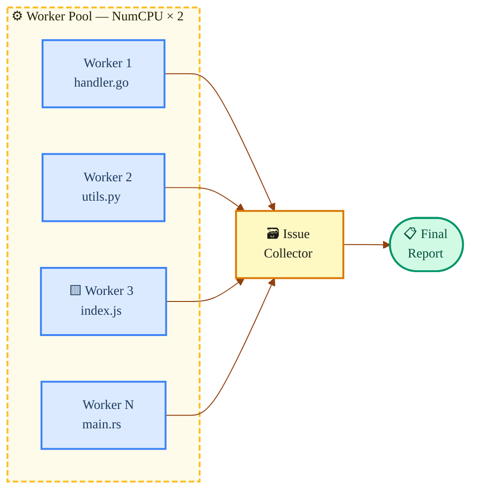

> **Relevant code:** `ollantascanner/executor/executor.go`

### Step 4: Report

After all rules run, the scanner consolidates everything into a report containing:

1. **Metadata** — project name, timestamp, scan duration
2. **Metrics** — file count, line count, bugs, code smells, vulnerabilities
3. **Issues** — each problem found, with file path, line, rule, severity, and message

The report is saved in two formats:
- **JSON** (`.ollanta/report.json`) — consumed by the API/server

Example:

```json
{
  "project": "MyProject",
  "timestamp": "2024-07-01T12:00:00Z",
  "metrics": {
    "files": 10,
    "lines": 1000,
    "bugs": 3,
    "code_smells": 15,
    "vulnerabilities": 0
  },
  "issues": [
    {
      "rule_key": "go:no-large-functions",
      "file_path": "handler.go",
      "line": 42,
      "severity": "major",
      "message": "Function 'handleRequest' has 120 lines, exceeding the limit of 40."
    },
    ...
  ]
}
```

- **SARIF** (`.ollanta/report.sarif`) — industry-standard format, integrates with GitHub, VS Code, etc.

Example:

```json
{
  "version": "2.1.0",
  "runs": [
    {
      "tool": {
        "driver": {
          "name": "Ollanta Scanner",
          "rules": [
            {
              "id": "go:no-large-functions",
              "name": "Function too long",
              "shortDescription": { "text": "Function has more than 40 lines" },
              "fullDescription": { "text": "Function 'handleRequest' has 120 lines, exceeding the recommended limit." },
              "defaultConfiguration": { "level": "error" }
            },
            ...
          ]
        }
      },
      "results": [
        {
          "ruleId": "go:no-large-functions",
          "message": { "text": "Function 'handleRequest' has 120 lines, exceeding the limit of 40." },
          "locations": [
            {
              "physicalLocation": {
                "artifactLocation": { "uri": "handler.go" },
                "region": { "startLine": 42 }
              }
            }
          ]
        },
        ...
      ]
    }
  ]
}
```

---

## Part 3: How the Server works

The server (`ollantaweb`) is where the magic of **tracking over time** happens. While the scanner is stateless (run and forget), the server maintains the complete history.

When the scanner sends a report to the server via `POST /api/v1/scans`, a 7-step pipeline executes in sequence:

1. **Register the project** — creates the project in the database if it doesn't exist yet.
2. **Fetch previous scan** — loads the open and closed issues from the last scan of the same project/branch.
3. **Compare issues** — applies the tracking algorithm to determine which issues are new, which remain open, which were fixed, and which reopened.
4. **Evaluate quality gate** — checks whether the project satisfies all configured conditions.
5. **Persist to database** — saves the scan, issues, and metrics in a single transaction.
6. **Index for search** — sends issues to the search backend (ZincSearch or Postgres FTS).
7. **Fire webhooks** — notifies registered external systems (CI, Slack, etc.).

The response returns `gate_status` (OK or ERROR), plus new and closed issue counts. Let's dig into the most interesting steps:

### How issue tracking works

This is one of the most important concepts in Ollanta. Without tracking, every scan would be independent — you'd have no way of knowing whether a bug is new or has been there all along.

**The problem:** between two scans, code changes. Lines are added and removed. An issue that was on line 42 might now be on line 47. How do you know it's the *same* issue?

**The solution: LineHash.** For each issue, Ollanta computes the SHA-256 of the line's content (ignoring whitespace). This hash is stable — regardless of whether the line number changed, the *content* stays the same.

The combination `(rule_key, line_hash)` acts as an issue's fingerprint.

**The matching algorithm operates in 2 layers:**

```mermaid

```

**Concrete example:**

| Previous scan (open issues) | Current scan | Result |
|-----------------------------|--------------|--------|
| `go:cognitive-complexity` in `handler.go` hash `a1b2` | Same combo present | **Unchanged** — problem persists |
| `go:magic-number` in `config.go` hash `c3d4` | Combo not found | **Closed** — was fixed! |
| — | `js:eqeqeq` in `app.js` hash `e5f6` (new) | **New** — new problem |
| `py:broad-except` in `main.py` hash `g7h8` (was closed) | Same combo reappears | **Reopened** — came back |

> **Relevant code:** `ollantaengine/tracking/tracker.go` and `domain/service/tracking.go`

### How the Quality Gate works

The quality gate is a set of conditions the project must satisfy. Think of it as a traffic light: green means OK; red means ERROR.

```mermaid
%%{init: {
  "theme": "base",
  "themeVariables": {
    "primaryColor": "#fef9c3",
    "primaryTextColor": "#1c1917",
    "primaryBorderColor": "#d97706",
    "lineColor": "#92400e",
    "edgeLabelBackground": "#fffbeb",
    "fontFamily": "ui-monospace, monospace",
    "fontSize": "14px",
    "clusterBkg": "#fef9c3",
    "clusterBorder": "#d97706"
  }
}}%%
graph LR
    Measures["📊 Scan metrics\nbugs: 3\nvulnerabilities: 0\ncode_smells: 15"]:::metrics

    Measures --> Gate

    subgraph Gate ["  🚦  Quality Gate  "]
        C1["bugs > 0?\n3 > 0 → ❌ FAIL"]:::fail
        C2["vulnerabilities > 0?\n0 > 0 → ✅ PASS"]:::pass
    end

    Gate --> Result{{"❓ Any condition\nfailed?"}}:::decision

    Result -->|"Yes"| ERROR(["🔴 ERROR\nProject did not pass"]):::err
    Result -->|"No"| OK(["🟢 OK\nProject approved"]):::ok

    classDef metrics  fill:#dbeafe,stroke:#3b82f6,stroke-width:2px,color:#1e3a5f
    classDef fail     fill:#fee2e2,stroke:#ef4444,stroke-width:2px,color:#7f1d1d
    classDef pass     fill:#d1fae5,stroke:#059669,stroke-width:2px,color:#064e3b
    classDef decision fill:#fef3c7,stroke:#f59e0b,stroke-width:2px,color:#92400e
    classDef err      fill:#fca5a5,stroke:#dc2626,stroke-width:2px,color:#7f1d1d
    classDef ok       fill:#6ee7b7,stroke:#059669,stroke-width:2px,color:#064e3b

    style Gate fill:#fffbeb,stroke:#fbbf24,stroke-width:2px,stroke-dasharray:6 3
```

**Default conditions:**

| Metric | Condition | Meaning |
|--------|-----------|---------|
| `bugs` | > 0 → ERROR | No bugs are tolerated |
| `vulnerabilities` | > 0 → ERROR | No vulnerabilities are tolerated |

You can create custom gates with additional conditions (minimum coverage, maximum duplication, etc.) and even evaluate **only new code** — useful for teams inheriting legacy projects who want to ensure new code doesn't introduce problems.

> **Relevant code:** `ollantaengine/qualitygate/gate.go`

---

## Part 4: The Rules System — how to add a rule

The rules system is designed to be extensible. Adding a new rule involves three things:

### 1. The detection logic (Go code)

Each rule is a function that receives an analysis context and returns the issues found:

```go
var MagicNumber = ollantarules.Rule{
    MetaKey: "go:magic-number",
    Check: func(ctx *ollantarules.AnalysisContext) []*domain.Issue {
        // Walks the AST looking for numeric literals
        // outside const/var declarations
        // If found → creates issue
    },
}
```

### 2. The metadata (embedded JSON)

Each rule has metadata describing its name, severity, type, and configurable parameters:

```json
{
  "key": "go:magic-number",
  "name": "Magic numbers should be extracted to constants",
  "language": "go",
  "type": "code_smell",
  "severity": "minor",
  "tags": ["readability"],
  "params": []
}
```

### 3. Registration in init()

At startup, all rules are registered in a global registry:

```go
func init() {
    ollantarules.MustRegister(MetaFS, "*.json",
        MagicNumber, TodoComment, CognitiveComplexity, ...)
}
```

`MustRegister` reads the metadata JSONs (embedded in the binary via `go:embed`), links each JSON to its `CheckFunc` by `MetaKey`, and registers everything in the global registry. At scan time, the sensor queries this registry to know which rules to run.

### How rules detect problems — the two sensors

There are two "sensors" that know how to execute rules, one for each parser type:

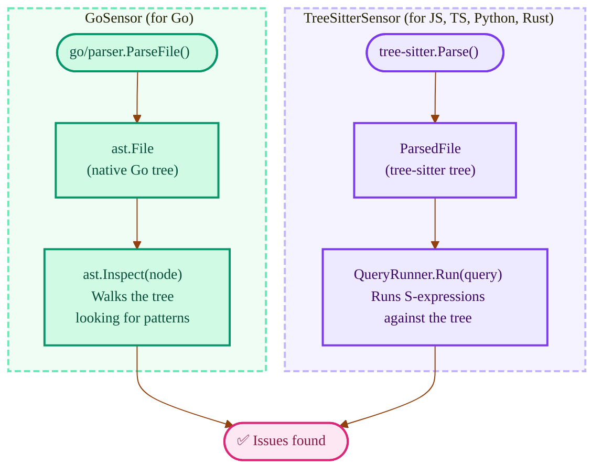

**S-expressions** are tree-sitter's query mechanism. They work like "CSS selectors for code" — they let you select patterns in the syntax tree in a declarative way. For example, to find all `console.log` calls in JavaScript:

```scheme
;; "Find all console.log calls"
(call_expression
  function: (member_expression
    property: (property_identifier) @prop
    (#eq? @prop "log")))
```

---

## Part 5: Internal Organization — Hexagonal Architecture

So far we've covered *what* Ollanta does. Now let's look at *how* the code is organized.

### The problem the architecture solves

Imagine that tomorrow we need to swap PostgreSQL for MySQL, or ZincSearch for Elasticsearch. If the business logic (issue tracking, quality gates) is tangled with database code, that becomes a nightmare.

**Hexagonal Architecture** solves this with one rule: **the business layer never knows which database, API, or framework is being used**. It only knows *interfaces* (ports).

### The three rings

Think of three concentric circles, like an onion:

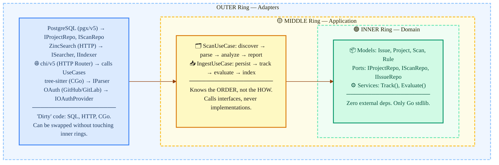

**The golden rule:** arrows always point inward. The outer ring knows the middle, the middle knows the inner, but **never** the other way around.

### How this maps to Go modules

Ollanta has 10 Go modules split into two groups: the **hexagonal core** (new, where code is being migrated) and **legacy modules** (functional, gradually being absorbed):

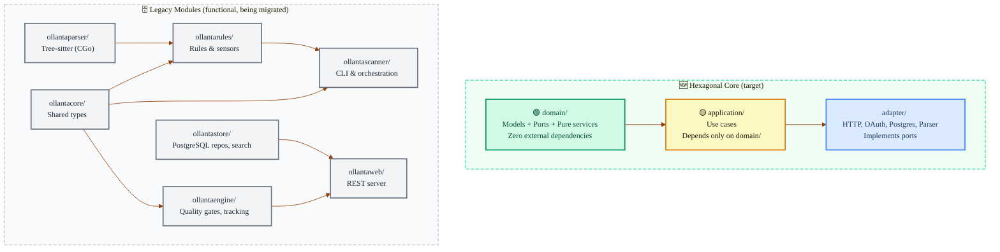

| Module | Ring | CGo? | What it does |
|--------|------|------|--------------|
| `domain` | 🟢 Inner | No | Pure models, port interfaces, I/O-free services |
| `application` | 🟡 Middle | No | Orchestrates use cases by calling ports |
| `adapter` | 🔵 Outer | Yes* | Implements ports with concrete technologies |
| `ollantacore` | Legacy | No | Shared types (`Issue`, `Rule`, `Component`) |
| `ollantaparser` | Legacy | **Yes** | Only module with CGo (tree-sitter) |
| `ollantarules` | Legacy | Yes* | Rule registry + Go/tree-sitter sensors |
| `ollantascanner` | Legacy | Yes* | CLI, file discovery, parallel execution |
| `ollantaengine` | Legacy | No | Quality gates, tracking, new-code periods |
| `ollantastore` | Legacy | No | PostgreSQL (pgx/v5), ZincSearch, Postgres FTS |
| `ollantaweb` | Legacy | No | HTTP server, ingestion, auth, webhooks |

_*CGo via transitive dependency on `ollantaparser`._

### The main ports (interfaces)

Ports are the "sockets" that connect the domain to the outside world. Here are the most important ones:

```go
// "Where do we store and fetch projects?"
IProjectRepo { Upsert, Create, GetByKey, GetByID, List, Delete }

// "Where do we store and fetch scans?"
IScanRepo { Create, Update, GetByID, GetLatest, ListByProject }

// "Where do we store and fetch issues?"
IIssueRepo { BulkInsert, Query, Facets, CountByProject, Transition }

// "How do we do full-text search?"
ISearcher { SearchIssues, SearchProjects }
IIndexer  { IndexIssues, IndexProject, ConfigureIndexes, ReindexAll }

// "How do we analyze code?"
IAnalyzer { Key, Name, Language, Check(ctx) }

// "How do we authenticate with external services?"
IOAuthProvider { AuthURL, Exchange }
```

The domain only knows these interfaces. Who implements them (PostgreSQL? MongoDB? ZincSearch? Elasticsearch?) is decided in the outer ring.

---

## Part 6: Advanced Engine Concepts

### New Code Period — "what counts as new code?"

When a team inherits a legacy project with 500 issues, it doesn't make sense to require fixing all of them at once. The **new code period** concept lets you focus only on new code: "from when are we measuring?". Ollanta supports 5 strategies for defining this baseline:

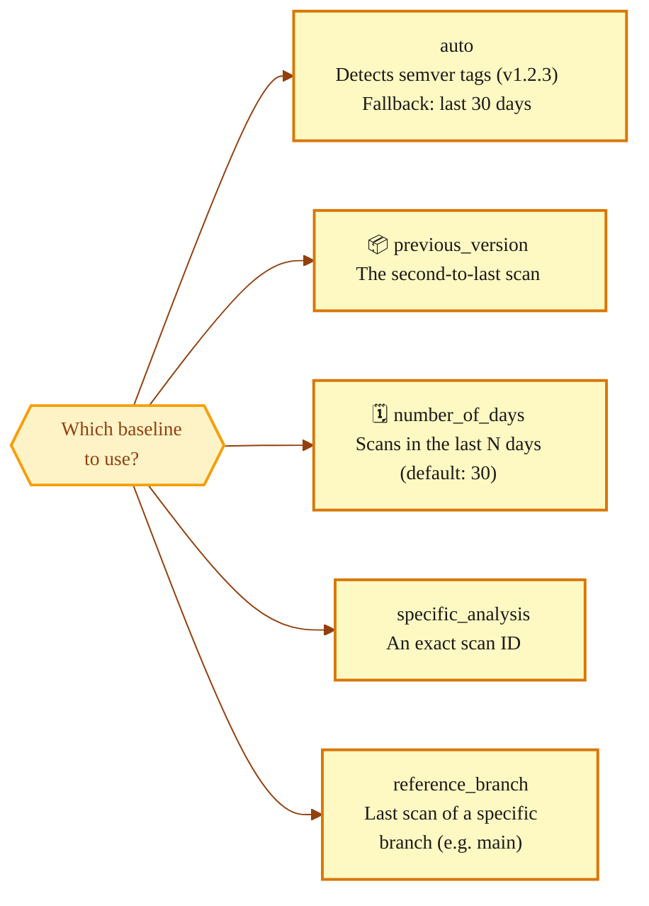

> **Relevant code:** `ollantaengine/newcode/resolver.go`

### Summarizer — bottom-up metrics

Ollanta organizes a project into a **component tree**: the project contains modules, which contain packages, which contain files. Metrics are computed at the file (leaf) level, but we need totals at the project level. The **summarizer** propagates metrics bottom-up:

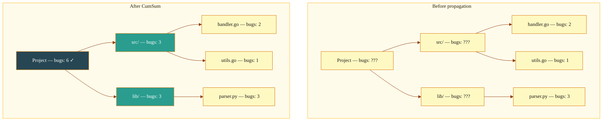

Two algorithms:
- **CumSum** — sum: the project's total bugs equals the sum of bugs across all files
- **CumAvg** — weighted average: the project's average complexity accounts for each file's size

> **Relevant code:** `ollantaengine/summarizer/cumsum.go`

---

## Part 7: Persistence and Search

### PostgreSQL — the primary database

All Ollanta data is stored in PostgreSQL 17. Here is the simplified data model:

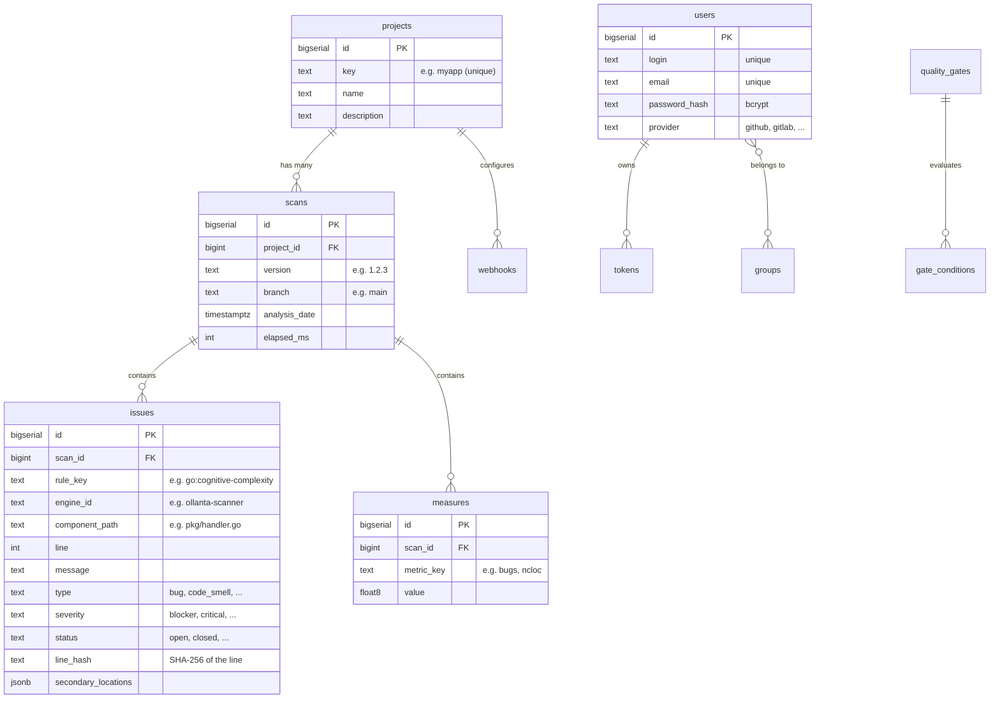

**Optimizations worth knowing:**

| Technique | Where | Why |
|-----------|-------|-----|
| **Partitioned table** | `issues` (by `created_at`) | Old scans can be pruned without reindexing. Queries on recent scans are fast |
| **COPY protocol** | Issue and measure inserts | Up to 50× faster than `INSERT` for thousands of rows |
| **Connection pool** | pgx pool (max 25, idle 5min) | Reuses TCP connections to the database |
| **Advisory locks** | Indexing coordination | Prevents two replicas from indexing the same scan |

### Full-text search — two options

Ollanta needs to search issues by free text (e.g., "all issues with 'null pointer'"). It offers two interchangeable backends:

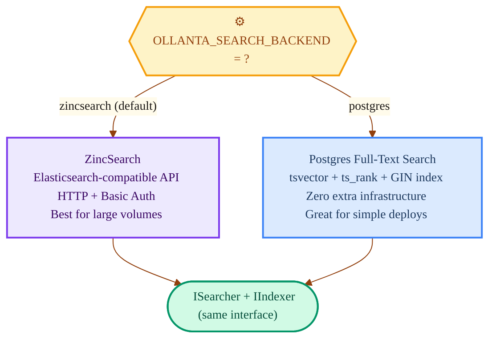

Switching backends is a single environment variable. Business code doesn't know (and doesn't need to know) which one is active.

> **Relevant code:** `ollantastore/search/port.go`, `ollantastore/search/factory.go`

### Indexing coordination — multi-replica

When the server runs on multiple replicas (for high availability), we need to ensure only ONE replica indexes each scan. Ollanta offers two mechanisms:

| Coordinator | How it works | When to use |
|-------------|--------------|-------------|
| **memory** | In-process Go channel, background goroutine | Single-replica, local development |
| **pgnotify** | `search_index_jobs` table + PostgreSQL `LISTEN/NOTIFY` + `FOR UPDATE SKIP LOCKED` | Multi-replica in production |

In `pgnotify` mode, the flow is:
1. Ingestion inserts a job into the `search_index_jobs` table
2. Sends `NOTIFY search_index_ready` via PostgreSQL
3. All replicas listen (`LISTEN`), but only one acquires the lock (`FOR UPDATE SKIP LOCKED`)
4. The replica that won the lock indexes and deletes the job

> **Relevant code:** `ollantaweb/pgnotify/coordinator.go`

---

## Part 8: Authentication and Authorization

### Three ways to authenticate

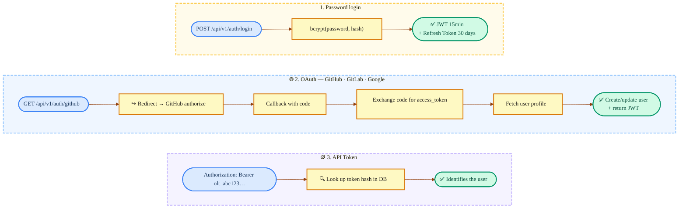

| Token type | Prefix | Lifetime | Typical use |
|------------|--------|----------|-------------|
| **Access Token** | (JWT) | 15 minutes | UI navigation, API calls |
| **Refresh Token** | `ort_` | 30 days | Renew the access token without re-login |
| **API Token** | `olt_` | No expiry | Automation, CI/CD, scanner |

### Permissions

Ollanta has two levels of permissions:

**Global** (apply to everything):
- `admin` — full access
- `manage_users` — create/edit/delete users
- `manage_groups` — manage groups

**Per-project** (apply to a specific project):
- `project_admin` — configure gates, profiles, webhooks
- `can_scan` — submit scan reports
- `can_view` — view results
- `can_comment` — transition issues (confirm, close, reopen)

Permissions can be assigned directly to users or to groups.

---

## Part 9: Infrastructure and Deployment

### Docker Compose — full environment

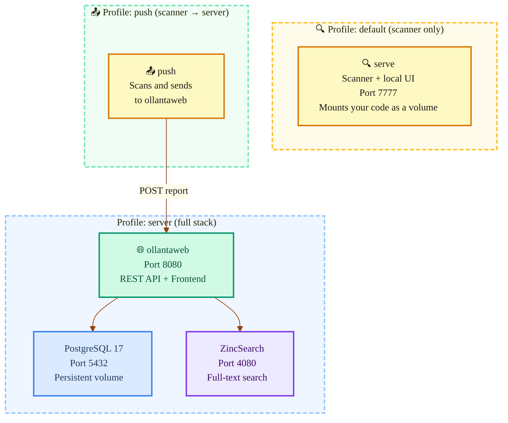

**Practical commands:**

```bash
# Just want to scan and see results locally?
docker compose up serve

# Want the full server stack with database, search, and API?
docker compose --profile server up -d

# Want to scan and push to the server?
PROJECT_DIR=/path/to/code docker compose run --rm push
```

### Environment variables

The most important ones for configuring the server:

| Variable | Default | What it does |
|----------|---------|--------------|
| `OLLANTA_DATABASE_URL` | *(required)* | PostgreSQL connection string |
| `OLLANTA_ADDR` | `:8080` | Address the server listens on |
| `OLLANTA_SEARCH_BACKEND` | `zincsearch` | Search backend (`zincsearch` or `postgres`) |
| `OLLANTA_INDEX_COORDINATOR` | `memory` | Indexing coordination (`memory` or `pgnotify`) |
| `OLLANTA_JWT_SECRET` | *(auto-generated)* | Secret for signing JWTs |
| `OLLANTA_JWT_EXPIRY` | `15m` | Access token lifetime |
| `OLLANTA_ZINCSEARCH_URL` | `http://localhost:4080` | ZincSearch URL |
| `OLLANTA_LOG_LEVEL` | `info` | Log level |

OAuth (optional — configure to enable social login):

| Variable | Purpose |
|----------|---------|
| `OLLANTA_GITHUB_CLIENT_ID` / `SECRET` | Login via GitHub |
| `OLLANTA_GITLAB_CLIENT_ID` / `SECRET` | Login via GitLab |
| `OLLANTA_GOOGLE_CLIENT_ID` / `SECRET` | Login via Google |
| `OLLANTA_OAUTH_REDIRECT_BASE` | Base URL for callbacks (e.g., `https://ollanta.example.com`) |

### Health checks

| Endpoint | What it checks | Returns 200 when |
|----------|----------------|-----------------|
| `GET /healthz` | Is the process alive? | Always (liveness) |
| `GET /readyz` | Are Postgres and search reachable? | When everything is ready (readiness) |
| `GET /metrics` | Prometheus metrics | Always |

### Multi-stage Docker build

Ollanta uses a two-stage build to keep the final image small and secure:

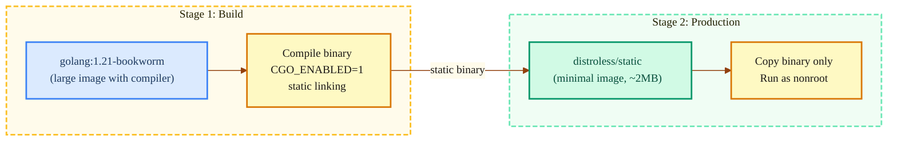

Result: final image is ~20 MB, no shell, no tools — minimal attack surface.

---

## Part 10: CI/CD

The pipeline runs on GitHub Actions with 5 parallel jobs:

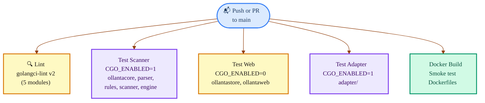

**Why split the tests?** Modules with CGo (`ollantaparser` and dependents) require a C compiler. Modules without CGo (`ollantaweb`, `ollantastore`) compile and test faster. Splitting them enables parallelism and faster failure detection.

**Active linters:** errcheck, staticcheck, govet, ineffassign, misspell, revive

---

## Part 11: REST API — Quick Reference

### Public endpoints (no authentication)

| Method | Route | Description |
|--------|-------|-------------|
| `GET` | `/healthz` | Liveness probe |
| `GET` | `/readyz` | Readiness probe |
| `GET` | `/metrics` | Prometheus metrics |
| `POST` | `/api/v1/auth/login` | Password login → JWT |
| `POST` | `/api/v1/auth/refresh` | Renew JWT with refresh token |
| `GET` | `/api/v1/auth/github` | Start GitHub OAuth login |
| `GET` | `/api/v1/projects/{key}/badge` | Quality gate SVG badge |

### Authenticated endpoints

**Projects and Scans:**

| Method | Route | Permission | Description |
|--------|-------|------------|-------------|
| `POST` | `/api/v1/projects` | `can_scan` | Create/update project |
| `GET` | `/api/v1/projects` | `can_view` | List projects |
| `GET` | `/api/v1/projects/{key}` | `can_view` | Project details |
| `POST` | `/api/v1/scans` | `can_scan` | Submit report (ingestion) |
| `GET` | `/api/v1/projects/{key}/scans` | `can_view` | Scan history |

**Issues and Search:**

| Method | Route | Permission | Description |
|--------|-------|------------|-------------|
| `GET` | `/api/v1/issues` | `can_view` | Search issues with filters and facets |
| `POST` | `/api/v1/issues/{id}/transition` | `can_comment` | Change status (confirm, close, reopen) |
| `GET` | `/api/v1/issues/{id}/changelog` | `can_view` | Transition history |
| `GET` | `/api/v1/search` | `can_view` | Full-text search |

**Administration:**

| Method | Route | Permission | Description |
|--------|-------|------------|-------------|
| `POST/GET` | `/api/v1/users` | `manage_users` | Manage users |
| `POST/GET` | `/api/v1/groups` | `manage_groups` | Manage groups |
| `POST/GET` | `/api/v1/gates` | `project_admin` | Configure quality gates |
| `POST/GET` | `/api/v1/profiles` | `project_admin` | Configure quality profiles |
| `PUT` | `/api/v1/projects/{key}/new-code` | `project_admin` | Configure new code period |
| `POST/GET` | `/api/v1/projects/{key}/webhooks` | `project_admin` | Manage webhooks |
| `POST` | `/api/v1/admin/reindex` | `admin` | Reindex search |

---

## Part 12: Webhooks — automatic notifications

Webhooks let external systems be notified when something happens in Ollanta.

### Available events

| Event | When it fires |
|-------|---------------|
| `scan.completed` | A scan was processed successfully |
| `gate.changed` | Quality gate status changed (OK → ERROR or vice versa) |
| `project.created` | A new project was created |
| `project.deleted` | A project was deleted |

### How delivery works

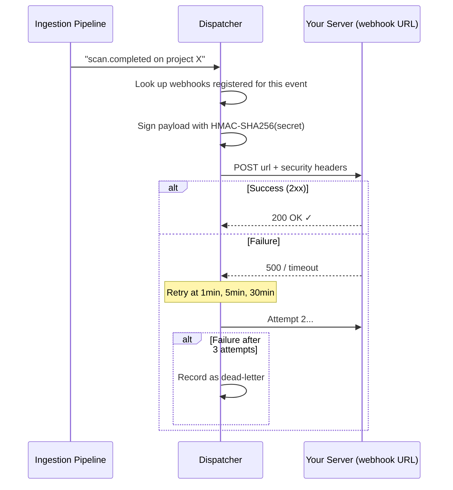

**Sent headers:**
- `X-Ollanta-Event: scan.completed` — which event
- `X-Ollanta-Signature: sha256=abc123...` — HMAC for authenticity verification
- `X-Ollanta-Delivery: uuid` — unique delivery ID

---

## Part 13: Database Migrations

The schema evolves via numbered migrations applied in order:

| # | What it creates | Why |
|---|-----------------|-----|
| 001 | `projects` | Register analyzed projects |
| 002 | `scans` | History of each scan run |
| 003 | `issues` (partitioned) | Found issues, with indexes for fast lookups |
| 004 | `measures` | Numeric metrics per scan |
| 005 | `users` | User accounts |
| 006 | `groups` + `group_members` | Groups for collective permissions |
| 007 | `permissions` | Global and per-project permissions |
| 008 | `tokens` | API tokens (prefix `olt_`) |
| 009 | `sessions` | Refresh tokens (prefix `ort_`) |
| 010 | Admin seed | Creates admin/admin user |
| 011 | `quality_profiles` + `profile_rules` | Per-language rule profiles |
| 012 | `quality_gates` + `gate_conditions` | Gates with configurable conditions |
| 013 | `new_code_periods` | Per-project baseline configuration |
| 014 | `webhooks` + `webhook_deliveries` | Webhooks and delivery log |
| 015 | Minor adjustments | Schema fixes |
| 016 | `resolution` column on `issues` | Closure reason (fixed, false_positive, won't_fix) |
| 017 | `engine_id` + `secondary_locations` | Multi-engine support and expanded context |
| 018 | `changelog` | Issue transition history |

---

## Glossary

| Term | Meaning |
|------|---------|
| **Issue** | A problem found in code (bug, vulnerability, code smell, hotspot) |
| **Scan** | A complete analysis run over a project |
| **Component** | A node in the hierarchy: project → module → package → file |
| **Rule** | A rule that knows how to detect one type of problem (e.g., "function too long") |
| **Measure** | A numeric metric value for a component (e.g., ncloc = 1500) |
| **Quality Gate** | A set of conditions that determine whether a project passes or fails |
| **Quality Profile** | A set of active rules for a language (e.g., "Sonar Way Go") |
| **New Code Period** | A reference point that defines what counts as "new code" |
| **LineHash** | SHA-256 of a line's content — the stable identity of an issue |
| **Tracking** | Algorithm that correlates issues across scans using (rule_key + line_hash) |
| **Sensor** | Component that runs rules: GoSensor (native Go) or TreeSitterSensor |
| **Ingestion** | Pipeline that receives a report and persists scans, issues, and metrics |
| **Port** | Interface that isolates the domain from concrete implementations (hexagonal) |
| **Adapter** | Concrete implementation of a port (e.g., PostgreSQL implements IProjectRepo) |
| **pgnotify** | Indexing coordination via PostgreSQL LISTEN/NOTIFY |
| **CumSum** | Metric propagation from leaves to the root of the component tree |
| **SARIF** | Static Analysis Results Interchange Format — industry-standard format |
        PG["secondary/postgres\npgx/v5"]
        SEARCH["secondary/search\nZincSearch · Postgres FTS"]
        OAUTH["secondary/oauth\nGitHub · GitLab · Google"]
        WH["secondary/webhook\noutbound dispatcher"]
        PARSER["secondary/parser\nTree-sitter CGo"]
        RULES_BRIDGE["secondary/rules\nrule registry bridge"]
    end

    subgraph App["📦 Application (use cases)"]
        UC["ingest · analysis\nscan orchestration"]
    end

    subgraph Domain["🏛️ Domain (inner core — zero external deps)"]
        D["pure models\nport interfaces\ndomain services"]
    end

    HTTP --> UC
    UC --> D
    PG --> D
    SEARCH --> D
    OAUTH --> D
    WH --> D
    PARSER --> D
    RULES_BRIDGE --> D
```

---

## Module Map

Each Go module has a single responsibility. Arrows mean "depends on".

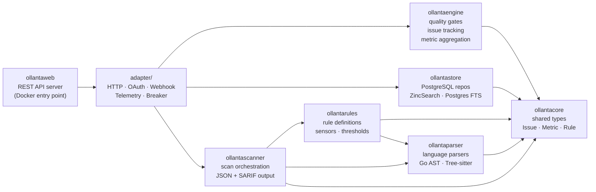

---

## Scan Pipeline

What happens from the moment you run `ollanta -project-dir .` to seeing results:

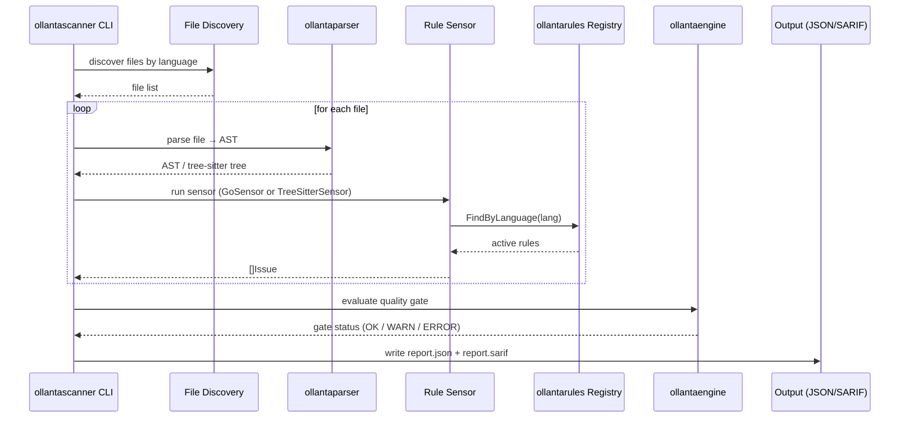

---

## Rule System

Each rule is a struct with three fields:

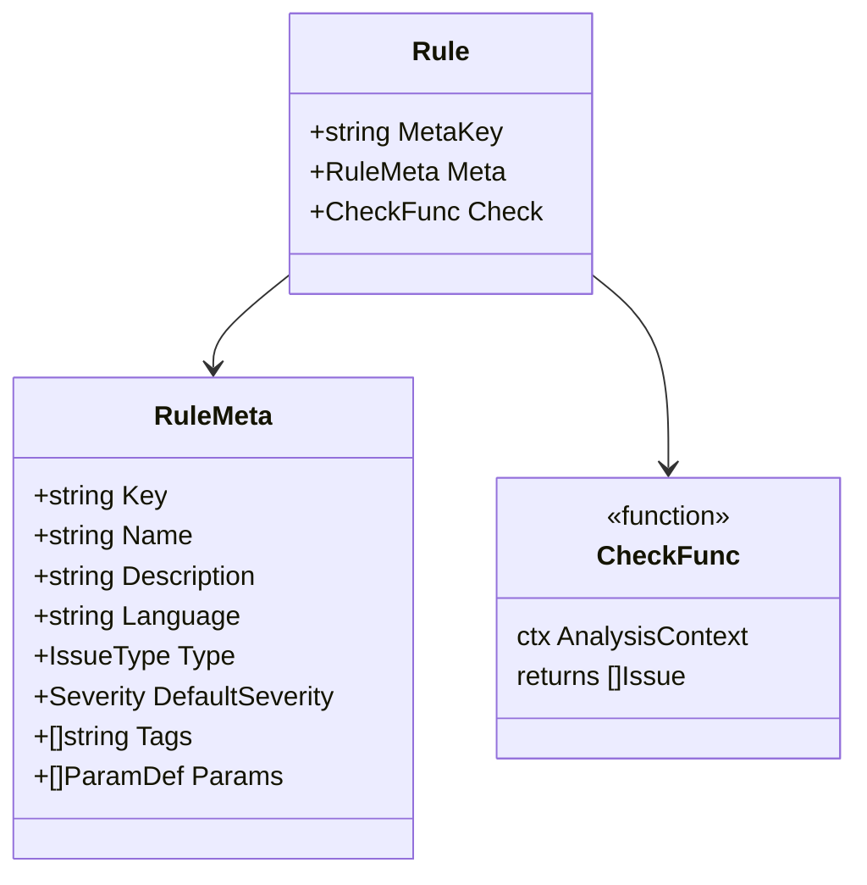

**How rules load at startup** — the `init()` pattern:

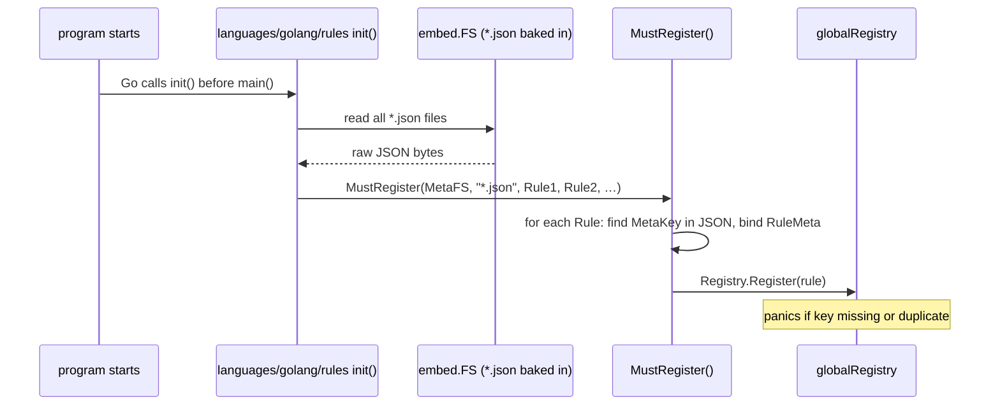

---

## Issue Tracking

After each scan, `ollantaengine/tracking` compares results against the previous baseline:

```mermaid
stateDiagram-v2
    [*] --> new : issue appears for first time
    new --> unchanged : still present in next scan
    unchanged --> unchanged : still present
    unchanged --> closed : no longer found
    closed --> reopened : appears again
    reopened --> unchanged : persists
    reopened --> closed : gone again
```

Issues are matched first by **rule key + line hash** (content-based), then by **file path + line number** as a fallback. This means reformatting code without changing logic won't produce spurious closed/reopened transitions.
