# Arquitetura do Ollanta

## O que é o Ollanta?

O Ollanta é uma plataforma de análise de código estático multi-linguagem, projetada para ser rápida, extensível e fácil de usar. Ele lê seu código-fonte, aplica um conjunto de regras para detectar problemas (bugs, code smells, vulnerabilidades), e gera relatórios detalhados. O Ollanta é inspirado em ferramentas como SonarQube, OpenStaticAnalyzer e o Semgrep, mas foi construído do zero com uma arquitetura moderna e modular.

Ele é capaz de ler seu código, entender sua estrutura, e apontar esses problemas automaticamente sem executar nada, apenas analisando o texto do código (por isso chamo de *análise estática*).

---

## Parte 1: Overview

### Os dois lados do Ollanta

O Ollanta tem duas metades que trabalham juntas:

```mermaid
%%{init: {
  "theme": "base",
  "themeVariables": {
    "primaryColor": "#fef9c3",
    "primaryTextColor": "#1c1917",
    "primaryBorderColor": "#d97706",
    "lineColor": "#92400e",
    "secondaryColor": "#dbeafe",
    "tertiaryColor": "#f0fdf4",
    "edgeLabelBackground": "#fffbeb",
    "fontFamily": "ui-monospace, monospace",
    "fontSize": "14px",
    "clusterBkg": "#fffbeb",
    "clusterBorder": "#fbbf24"
  }
}}%%
graph LR
    subgraph SCAN ["  🔍  Scanner  "]
        A(["📁 Seu código"]):::src
        B["🗂️ Descobrir\narquivos"]:::step
        C["🌳 Parsear\ncada arquivo"]:::step
        D["📏 Aplicar\nregras"]:::step
        E["📄 Gerar\nrelatório"]:::step
        A --> B --> C --> D --> E
    end

    E -- "📤 envia relatório" --> F

    subgraph SRV ["  🏢  Servidor  "]
        F["📥 Receber\nrelatório"]:::step
        G["🔄 Comparar com\nscan anterior"]:::step
        H["🚦 Avaliar\nquality gate"]:::step
        I["💾 Guardar\nno banco"]:::step
        J(["🌐 API"]):::out
        F --> G --> H --> I --> J
    end

    classDef src  fill:#dbeafe,stroke:#3b82f6,stroke-width:2px,rx:12,color:#1e3a5f
    classDef step fill:#fef9c3,stroke:#d97706,stroke-width:2px,color:#1c1917
    classDef out  fill:#d1fae5,stroke:#059669,stroke-width:2px,rx:12,color:#064e3b

    style SCAN fill:#fffbeb,stroke:#fbbf24,stroke-width:2px,stroke-dasharray:6 3,rx:16
    style SRV  fill:#f0f9ff,stroke:#7dd3fc,stroke-width:2px,stroke-dasharray:6 3,rx:16
```

**O Scanner** analisa o seu código-fonte localmente e produz um relatório com os problemas encontrados. Pode rodar sozinho no terminal, gerar um arquivo JSON/SARIF, ou abrir uma interface web local para visualizar os resultados.

**O Servidor** recebe relatórios de múltiplos projetos, armazena o histórico de scans, rastreia a evolução das issues ao longo do tempo e avalia quality gates.

### Modos de uso na prática

| Situação | Comando | O que acontece |
|----------|---------|----------------|
| "Quero ver os problemas do meu código agora" | `ollanta -project-dir . -local-ui` | Scanner roda, abre UI local na porta 7777 |
| "Quero um relatório para o CI" | `ollanta -project-dir . -format sarif` | Scanner gera `.ollanta/report.sarif` |
| "Quero histórico centralizado" | `ollanta -project-dir . -server http://host:8080` | Scanner envia relatório ao servidor |
| "Quero acessar resultados via API" | `curl http://host:8080/api/v1/issues` | Servidor expõe dados via REST |

---

## Parte 2: Como o Scanner funciona

Quando você roda o scanner, acontecem 4 etapas em sequência. Vamos percorrer cada uma:

### Etapa 1: Descoberta de Arquivos

Primeiro, o scanner precisa saber *quais* arquivos analisar. Ele caminha recursivamente pelo diretório do projeto, olha a extensão de cada arquivo, e decide a linguagem:

```
.go     → Go
.js     → JavaScript
.mjs    → JavaScript
.ts     → TypeScript
.tsx    → TypeScript
.py     → Python
.rs     → Rust
```

Os seguintes diretórios são sempre ignorados, independente de configuração:

```
vendor/    node_modules/    .git/    testdata/    _build/    .ollanta/
```

Para excluir arquivos adicionais, use o flag `-exclusions` com padrões glob separados por vírgula:

```
ollanta -project-dir . -exclusions "*_test.go,generated/**"
```

> **Código relevante:** `application/scan/discovery.go`

---

### Etapa 2: Parsing

Código-fonte é só texto. Para entender sua estrutura, precisamos transformá-lo em uma **árvore sintática**, uma representação que sabe onde começa cada função, cada `if`, cada variável. O Ollanta usa **duas estratégias de parsing** diferentes:

```mermaid
%%{init: {
  "theme": "base",
  "themeVariables": {
    "primaryColor": "#fef9c3",
    "primaryTextColor": "#1c1917",
    "primaryBorderColor": "#d97706",
    "lineColor": "#92400e",
    "edgeLabelBackground": "#fffbeb",
    "fontFamily": "ui-monospace, monospace",
    "fontSize": "14px"
  }
}}%%
graph TD
    File(["📄 arquivo.go / arquivo.js"]):::src

    File --> Check{{"🔀 Qual linguagem?"}}:::decision

    Check -->|"Go"| GoParser["🐹 go/parser\n(stdlib nativa, sem CGo)\n→ ast.File"]:::gonode
    Check -->|"JS · TS · Python · Rust"| TSParser["🌳 tree-sitter\n(biblioteca em C, via CGo)\n→ ParsedFile com Tree"]:::tsnode

    GoParser --> Rules(["✅ Pronto para\naplicar regras"]):::out
    TSParser --> Rules

    classDef src      fill:#dbeafe,stroke:#3b82f6,stroke-width:2px,color:#1e3a5f
    classDef decision fill:#fef3c7,stroke:#f59e0b,stroke-width:2px,color:#92400e
    classDef gonode   fill:#d1fae5,stroke:#059669,stroke-width:2px,color:#064e3b
    classDef tsnode   fill:#ede9fe,stroke:#7c3aed,stroke-width:2px,color:#3b0764
    classDef out      fill:#fce7f3,stroke:#db2777,stroke-width:2px,color:#831843
```

**Por que dois parsers?** O Go tem um parser excelente na própria standard library (`go/parser`). Para as outras linguagens, usamos o [tree-sitter](https://tree-sitter.github.io/), um parser incremental muito rápido que suporta dezenas de linguagens via gramáticas plugáveis.

> **Detalhe técnico importante:** O tree-sitter é escrito em C/Rust, então o módulo `ollantaparser` é o **único** que precisa de CGo (compilador C). Todos os outros módulos do Ollanta funcionam sem CGo, o que simplifica builds e deploys.

> **Código relevante:** `ollantaparser/` (tree-sitter) e `ollantarules/languages/golang/sensor/` (Go nativo)

---

### Etapa 3: Execução de Regras

Com a árvore sintática pronta, o scanner aplica **regras**, cada regra sabe detectar um tipo específico de problema. Por exemplo:

- *"Esta função tem mais de 40 linhas"* → regra `go:no-large-functions`
- *"Este `==` deveria ser `===`"* → regra `js:eqeqeq`
- *"Está usando `except Exception:` genérico"* → regra `py:broad-except`

A execução é **paralela**: o scanner distribui os arquivos por um pool de workers (2× o número de CPUs) e cada worker processa um arquivo de cada vez. Se um arquivo causar um panic, o worker se recupera e continua com o próximo. Ou seja, um arquivo problemático não derruba o scan inteiro.

```mermaid
%%{init: {
  "theme": "base",
  "themeVariables": {
    "primaryColor": "#fef9c3",
    "primaryTextColor": "#1c1917",
    "primaryBorderColor": "#d97706",
    "lineColor": "#92400e",
    "edgeLabelBackground": "#fffbeb",
    "fontFamily": "ui-monospace, monospace",
    "fontSize": "14px",
    "clusterBkg": "#fffbeb",
    "clusterBorder": "#fbbf24"
  }
}}%%
graph LR
    subgraph POOL ["  ⚙️  Pool de Workers — NumCPU × 2  "]
        W1["🐹 Worker 1\nhandler.go"]:::worker
        W2["🐍 Worker 2\nutils.py"]:::worker
        W3["🟨 Worker 3\nindex.js"]:::worker
        W4["🦀 Worker N\nmain.rs"]:::worker
    end

    W1 --> Agg
    W2 --> Agg
    W3 --> Agg
    W4 --> Agg

    Agg["🗃️ Coletor\nde Issues"]:::agg
    Agg --> Report(["📋 Relatório\nFinal"]):::out

    classDef worker fill:#dbeafe,stroke:#3b82f6,stroke-width:2px,color:#1e3a5f
    classDef agg    fill:#fef9c3,stroke:#d97706,stroke-width:2px,color:#1c1917
    classDef out    fill:#d1fae5,stroke:#059669,stroke-width:2px,color:#064e3b

    style POOL fill:#fffbeb,stroke:#fbbf24,stroke-width:2px,stroke-dasharray:6 3
```

> **Código relevante:** `application/scan/executor.go`

### Etapa 4: Relatório

Após todas as regras rodarem, o scanner consolida tudo em um relatório que contém:

1. **Metadados** — chave do projeto, data, duração do scan e escopo de branch ou pull request
2. **Métricas** — arquivos, linhas, bugs, code smells, vulnerabilidades e, opcionalmente, cobertura, testes e mutação
3. **Issues** — cada problema encontrado, com arquivo, linha, regra, severidade, mensagem, tags, linguagem e domínio de qualidade derivado

O relatório é salvo em dois formatos:
- **JSON** (`.ollanta/report.json`) — para consumo pela API/servidor

Exemplo:

```json
{
  "metadata": {
    "project_key": "MeuProjeto",
    "analysis_date": "2024-07-01T12:00:00Z",
    "scope_type": "branch",
    "branch": "main"
  },
  "measures": {
    "files": 10,
    "lines": 1000,
    "bugs": 3,
    "code_smells": 15,
    "vulnerabilities": 0,
    "coverage": 82.5,
    "tests": 120,
    "test_failures": 0,
    "mutation_score": 74.2,
    "mutants_survived": 8
  },
  "issues": [
    {
      "rule_key": "go:no-large-functions",
      "component_path": "handler.go",
      "line": 42,
      "type": "code_smell",
      "severity": "major",
      "quality_domain": "maintainability",
      "language": "go",
      "tags": ["size", "maintainability"],
      "message": "Função 'handleRequest' tem 120 linhas, excedendo o limite de 40."
    }
  ]
}
```

- **SARIF** (`.ollanta/report.sarif`) — formato padrão da indústria, integra com GitHub, VS Code, etc.

Exemplo:

```json
{
  "version": "2.1.0",
  "runs": [
    {
      "tool": {
        "driver": {
          "name": "Ollanta Scanner",
          "rules": [
            {
              "id": "go:no-large-functions",
              "name": "Função muito longa",
              "shortDescription": { "text": "Função tem mais de 40 linhas" },
              "fullDescription": { "text": "Função 'handleRequest' tem 120 linhas, excedendo o limite recomendado." },
              "defaultConfiguration": { "level": "error" }
            },
            ...
          ]
        }
      },
      "results": [
        {
          "ruleId": "go:no-large-functions",
          "message": { "text": "Função 'handleRequest' tem 120 linhas, excedendo o limite de 40." },
          "locations": [
            {
              "physicalLocation": {
                "artifactLocation": { "uri": "handler.go" },
                "region": { "startLine": 42 }
              }
            }
          ]
        },
        ...
      ]
    }
  ]
}
```

---

## Parte 3: Como o Servidor funciona

O servidor (`ollantaweb`) é onde a mágica de **acompanhamento ao longo do tempo** acontece. Enquanto o scanner é "stateless" (roda e esquece), o servidor mantém o histórico completo.

Quando o scanner envia um relatório para o servidor via `POST /api/v1/scans`, um pipeline de 8 passos é executado. Cada passo tem timeout individual e estratégia de erro (abort ou skip):

1. **Registrar o projeto** — cria o projeto no banco se ainda não existir (abort on fail).
2. **Buscar scan anterior** — carrega o último scan do mesmo projeto para tracking (skip on fail).
3. **Comparar issues** — aplica o algoritmo de tracking para determinar quais issues são novas, quais continuam abertas, quais foram corrigidas e quais reapareceram (abort on fail).
4. **Avaliar quality gate** — verifica se o projeto satisfaz todas as condições configuradas (skip on fail).
5. **Inserir scan** — persiste o registro do scan com métricas e status do gate (abort on fail).
6. **Inserir issues** — bulk insert de todas as issues via COPY protocol (abort on fail).
7. **Inserir métricas** — bulk insert das medidas agregadas (abort on fail).
8. **Indexar para busca** — enfileira indexação async no backend de busca (skip on fail).

Webhooks são disparados pelo handler HTTP após o pipeline retornar, não dentro do pipeline em si.

A resposta retorna `gate_status` (OK ou ERROR), contagem de issues novas e fechadas. Vamos aprofundar os passos mais interessantes:

### Como o tracking de issues funcionam

Este é um dos conceitos mais importantes do Ollanta. Sem tracking, cada scan seria independente, você não saberia se um bug é novo ou se já existia antes.

**O problema:** entre dois scans, o código muda. Linhas são adicionadas e removidas. Uma issue que estava na linha 42 pode agora estar na linha 47. Como saber que é a *mesma* issue?

**A solução: LineHash.** Para cada issue, o Ollanta calcula o SHA-256 do conteúdo da linha onde o problema está (ignorando espaços). Esse hash é estável, não importa se a linha mudou de número, o *conteúdo* continua o mesmo.

A combinação `(rule_key, line_hash)` funciona como a "impressão digital" de uma issue.

**O algoritmo de matching opera em 2 camadas:**

```mermaid
%%{init: {
  "theme": "base",
  "themeVariables": {
    "primaryColor": "#fef9c3",
    "primaryTextColor": "#1c1917",
    "primaryBorderColor": "#d97706",
    "lineColor": "#92400e",
    "edgeLabelBackground": "#fffbeb",
    "fontFamily": "ui-monospace, monospace",
    "fontSize": "14px",
    "clusterBkg": "#fffbeb",
    "clusterBorder": "#fbbf24"
  }
}}%%
flowchart TD
    CI(["📋 Issue no scan atual\n(rule_key + arquivo + line_hash)"]):::src

    L1{{"🔍 Camada 1\nCorrespondência exata?\n(rule_key + arquivo + line_hash)\nnos issues ABERTOS anteriores"}}:::decision
    L2{{"🔍 Camada 2\nCorrespondência solta?\n(rule_key + line_hash)\nem qualquer arquivo anterior"}}:::decision
    WC{{"❓ Estava FECHADA\nanteriormente?"}}:::decision

    Unchanged(["♻️ Unchanged\nproblema continua"]):::keep
    Moved(["🔀 Moved\nmesmo conteúdo, local diferente"]):::keep
    Reopened(["🔄 Reopened\nvoltou!"]):::warn
    New(["🆕 New\nnunca visto antes"]):::new_

    Unmatched(["📋 Issue ABERTA anterior\nsem correspondência"]):::prev
    Closed(["✅ Closed\nfoi corrigido!"]):::fixed

    CI --> L1
    L1 -->|"✅ Sim"| Unchanged
    L1 -->|"❌ Não"| L2
    L2 -->|"✅ Sim"| Moved
    L2 -->|"❌ Não"| WC
    WC -->|"Sim"| Reopened
    WC -->|"Não"| New

    Unmatched --> Closed

    classDef src      fill:#dbeafe,stroke:#3b82f6,stroke-width:2px,color:#1e3a5f
    classDef decision fill:#fef3c7,stroke:#f59e0b,stroke-width:2px,color:#92400e
    classDef keep     fill:#d1fae5,stroke:#059669,stroke-width:2px,color:#064e3b
    classDef warn     fill:#fef9c3,stroke:#d97706,stroke-width:2px,color:#1c1917
    classDef new_     fill:#ede9fe,stroke:#7c3aed,stroke-width:2px,color:#3b0764
    classDef prev     fill:#f3f4f6,stroke:#6b7280,stroke-width:2px,color:#1f2937
    classDef fixed    fill:#d1fae5,stroke:#059669,stroke-width:2px,color:#064e3b
```

**Exemplo concreto:**

| Scan anterior (issues abertas) | Scan atual | Resultado |
|-------------------------------|------------|-----------|
| `go:cognitive-complexity` em `handler.go` hash `a1b2` | Mesma combinação presente | **Unchanged** — problema continua |
| `go:magic-number` em `config.go` hash `c3d4` | Combinação não encontrada | **Closed** — foi corrigido! |
| — | `js:eqeqeq` em `app.js` hash `e5f6` (nova) | **New** — problema novo |
| `py:broad-except` em `main.py` hash `g7h8` (estava fechada) | Mesma combinação reaparece | **Reopened** — voltou |

> **Código relevante:** `ollantaengine/tracking/tracker.go` e `domain/service/tracking.go`

### Como o Quality Gate funciona

O quality gate é um conjunto de condições que o projeto precisa satisfazer. Pense nele como um "semáforo": se passa, está verde (OK); se não passa, está vermelho (ERROR).

```mermaid
%%{init: {
  "theme": "base",
  "themeVariables": {
    "primaryColor": "#fef9c3",
    "primaryTextColor": "#1c1917",
    "primaryBorderColor": "#d97706",
    "lineColor": "#92400e",
    "edgeLabelBackground": "#fffbeb",
    "fontFamily": "ui-monospace, monospace",
    "fontSize": "14px",
    "clusterBkg": "#fef9c3",
    "clusterBorder": "#d97706"
  }
}}%%
graph LR
    Measures["📊 Métricas do scan\nbugs: 3\nvulnerabilities: 0\ncode_smells: 15"]:::metrics

    Measures --> Gate

    subgraph Gate ["  🚦  Quality Gate  "]
        C1["bugs > 0?\n3 > 0 → ❌ FAIL"]:::fail
        C2["vulnerabilities > 0?\n0 > 0 → ✅ PASS"]:::pass
    end

    Gate --> Result{{"❓ Alguma condição\nfalhou?"}}:::decision

    Result -->|"Sim"| ERROR(["🔴 ERROR\nProjeto não passa"]):::err
    Result -->|"Não"| OK(["🟢 OK\nProjeto aprovado"]):::ok

    classDef metrics  fill:#dbeafe,stroke:#3b82f6,stroke-width:2px,color:#1e3a5f
    classDef fail     fill:#fee2e2,stroke:#ef4444,stroke-width:2px,color:#7f1d1d
    classDef pass     fill:#d1fae5,stroke:#059669,stroke-width:2px,color:#064e3b
    classDef decision fill:#fef3c7,stroke:#f59e0b,stroke-width:2px,color:#92400e
    classDef err      fill:#fca5a5,stroke:#dc2626,stroke-width:2px,color:#7f1d1d
    classDef ok       fill:#6ee7b7,stroke:#059669,stroke-width:2px,color:#064e3b

    style Gate fill:#fffbeb,stroke:#fbbf24,stroke-width:2px,stroke-dasharray:6 3
```

**Condições padrão:**

| Métrica | Condição | Significado |
|---------|----------|-------------|
| `bugs` | > 0 → ERROR | Nenhum bug é tolerado |
| `vulnerabilities` | > 0 → ERROR | Nenhuma vulnerabilidade é tolerada |

Você pode criar gates personalizados com condições adicionais (cobertura mínima, duplicação máxima, etc.) e até avaliar **apenas o código novo** útil para equipes que herdam projetos legados e querem garantir que código novo não introduza problemas.

> **Código relevante:** `ollantaengine/qualitygate/gate.go`

---

## Parte 4: O Sistema de Regras — como se adiciona uma regra

O sistema de regras é projetado para ser extensível. Adicionar uma nova regra envolve três coisas:

### 1. A lógica de detecção (Go code)

Cada regra é uma função que recebe um contexto de análise e retorna issues encontradas:

```go
var MagicNumber = ollantarules.Rule{
    MetaKey: "go:magic-number",
    Check: func(ctx *ollantarules.AnalysisContext) []*domain.Issue {
        // Percorre a AST procurando literais numéricos
        // fora de declarações const/var
        // Se encontrar → cria issue
    },
}
```

### 2. Os metadados (JSON embarcado)

Cada regra tem metadados que descrevem seu nome, severidade, tipo e parâmetros configuráveis:

```json
{
  "key": "go:magic-number",
  "name": "Números mágicos devem ser extraídos para constantes",
  "language": "go",
  "type": "code_smell",
  "severity": "minor",
  "tags": ["readability"],
  "params": []
}
```

### 3. O registro no init()

Na inicialização do programa, todas as regras são registradas num registry global:

```go
func init() {
    ollantarules.MustRegister(MetaFS, "*.json",
        MagicNumber, TodoComment, CognitiveComplexity, ...)
}
```

O `MustRegister` lê os JSONs de metadata (embarcados no binário via `go:embed`), vincula cada JSON com sua `CheckFunc` pelo `MetaKey`, e registra tudo no registry global. Na hora do scan, o sensor consulta esse registry para saber quais regras rodar.

### Como as regras detectam problemas, os dois sensores

Existem dois "sensores" que sabem executar regras, um para cada tipo de parser:

```mermaid
%%{init: {
  "theme": "base",
  "themeVariables": {
    "primaryColor": "#fef9c3",
    "primaryTextColor": "#1c1917",
    "primaryBorderColor": "#d97706",
    "lineColor": "#92400e",
    "edgeLabelBackground": "#fffbeb",
    "fontFamily": "ui-monospace, monospace",
    "fontSize": "14px",
    "clusterBkg": "#fffbeb",
    "clusterBorder": "#fbbf24"
  }
}}%%
graph TB
    subgraph GOSENSOR ["  🐹  GoSensor (para Go)  "]
        GA(["go/parser.ParseFile()"]):::gosrc
        GAST["ast.File\n(árvore Go nativa)"]:::gonode
        GI["ast.Inspect(node)\nPercorre a árvore\nprocurando padrões"]:::gonode
        GA --> GAST --> GI
    end

    subgraph TSSENSOR ["  🌳  TreeSitterSensor (para JS, TS, Python, Rust)  "]
        TA(["tree-sitter.Parse()"]):::tssrc
        TAST["ParsedFile\n(árvore tree-sitter)"]:::tsnode
        TQ["QueryRunner.Run(query)\nExecuta S-expressions\ncontra a árvore"]:::tsnode
        TA --> TAST --> TQ
    end

    GI --> Out(["✅ Issues encontradas"]):::out
    TQ --> Out

    classDef gosrc  fill:#d1fae5,stroke:#059669,stroke-width:2px,color:#064e3b
    classDef gonode fill:#d1fae5,stroke:#059669,stroke-width:2px,color:#064e3b
    classDef tssrc  fill:#ede9fe,stroke:#7c3aed,stroke-width:2px,color:#3b0764
    classDef tsnode fill:#ede9fe,stroke:#7c3aed,stroke-width:2px,color:#3b0764
    classDef out    fill:#fce7f3,stroke:#db2777,stroke-width:2px,color:#831843

    style GOSENSOR fill:#f0fdf4,stroke:#6ee7b7,stroke-width:2px,stroke-dasharray:6 3
    style TSSENSOR fill:#f5f3ff,stroke:#c4b5fd,stroke-width:2px,stroke-dasharray:6 3
```

**S-expressions** são o mecanismo de query do tree-sitter. Funcionam como "CSS selectors para código", isto é, permitem selecionar padrões na árvore sintática de forma declarativa. Por exemplo, para encontrar todas as chamadas de `console.log` em JavaScript:

```scheme
;; "Encontre todas as chamadas de console.log"
(call_expression
  function: (member_expression
    property: (property_identifier) @prop
    (#eq? @prop "log")))
```

---

## Parte 5: A Organização Interna — Arquitetura Hexagonal

Até aqui explico *o que* o Ollanta faz. Agora vamos entender *como* o código é organizado.

### O problema que a arquitetura resolve

Imagine que amanhã precisamos trocar o PostgreSQL por MySQL, ou o ZincSearch por Elasticsearch. Se o código de negócio (tracking de issues, quality gates) estiver misturado com código de banco de dados, a se torna um pesadelo.

A **Arquitetura Hexagonal** resolve isso com uma regra simples: **a camada de negócio nunca sabe qual banco de dados, API, ou framework está sendo usado**. Ele só conhece *interfaces* (ports).

### Os três anéis

Pense em três círculos concêntricos, como uma cebola:

```mermaid
%%{init: {
  "theme": "base",
  "themeVariables": {
    "primaryColor": "#fef9c3",
    "primaryTextColor": "#1c1917",
    "primaryBorderColor": "#d97706",
    "lineColor": "#92400e",
    "edgeLabelBackground": "#fffbeb",
    "fontFamily": "ui-monospace, monospace",
    "fontSize": "14px",
    "clusterBkg": "#fffbeb",
    "clusterBorder": "#fbbf24"
  }
}}%%
graph TB
    subgraph EXTERNO ["  🔵  Anel EXTERNO — Adaptadores  "]
        subgraph MEDIO ["  🟡  Anel MÉDIO — Aplicação  "]
            subgraph INTERNO ["  🟢  Anel INTERNO — Domínio  "]
                D["📦 Modelos: Issue, Project, Scan, Rule\n🔌 Ports: IProjectRepo, IScanRepo, IIssueRepo\n⚙️ Serviços: Track(), Evaluate()\n────────────────────\nZero deps externas. Só stdlib do Go."]:::inner
            end
            A["🗂️ ScanUseCase: descobre → parseia → analisa → relata\n📥 IngestUseCase: persiste → rastreia → avalia → indexa\n────────────────────\nConhece a ORDEM, não o COMO.\nChama interfaces, nunca implementações."]:::middle
        end
        E["🐘 PostgreSQL (pgx/v5) → IProjectRepo, IScanRepo\n🔎 ZincSearch (HTTP) → ISearcher, IIndexer\n🌐 chi/v5 (HTTP Router) → chama os UseCases\n🌳 tree-sitter (CGo) → IParser\n🔑 OAuth (GitHub/GitLab) → IOAuthProvider\n────────────────────\nCódigo 'sujo': SQL, HTTP, CGo.\nPode ser trocado sem mexer nos anéis internos."]:::outer
    end

    E --> A --> D

    classDef inner  fill:#d1fae5,stroke:#059669,stroke-width:2px,color:#064e3b
    classDef middle fill:#fef9c3,stroke:#d97706,stroke-width:2px,color:#1c1917
    classDef outer  fill:#dbeafe,stroke:#3b82f6,stroke-width:2px,color:#1e3a5f

    style INTERNO fill:#f0fdf4,stroke:#6ee7b7,stroke-width:2px,stroke-dasharray:6 3
    style MEDIO   fill:#fefce8,stroke:#fbbf24,stroke-width:2px,stroke-dasharray:6 3
    style EXTERNO fill:#eff6ff,stroke:#93c5fd,stroke-width:2px,stroke-dasharray:6 3
```

**A regra de ouro:** as setas sempre apontam para dentro. O anel externo conhece o médio, o médio conhece o interno, mas **nunca** o contrário.

### Como isso se mapeia nos módulos Go

O Ollanta tem 10 módulos Go. Eles se dividem em dois grupos: o **núcleo hexagonal** (novo, onde o código está sendo migrado) e os **módulos legados** (funcionais, mas sendo gradualmente absorvidos):

```mermaid
%%{init: {
  "theme": "base",
  "themeVariables": {
    "primaryColor": "#fef9c3",
    "primaryTextColor": "#1c1917",
    "primaryBorderColor": "#d97706",
    "lineColor": "#92400e",
    "edgeLabelBackground": "#fffbeb",
    "fontFamily": "ui-monospace, monospace",
    "fontSize": "14px",
    "clusterBkg": "#fffbeb",
    "clusterBorder": "#fbbf24"
  }
}}%%
graph TB
    subgraph NOVO ["  🆕  Núcleo Hexagonal (futuro)  "]
        domain["🟢 domain/\nModelos + Ports + Serviços puros\nZero dependências externas"]:::inner
        application["🟡 application/\nCasos de uso\nDepende apenas de domain/"]:::middle
        adapter["🔵 adapter/\nHTTP, OAuth, Postgres, Parser\nImplementa os ports"]:::outer
        domain --> application --> adapter
    end

    subgraph LEGADO ["  🗄️  Módulos Legados (funcional, sendo migrado)  "]
        ollantacore["ollantacore/\nTipos compartilhados"]:::leg
        ollantaparser["ollantaparser/\nTree-sitter (CGo)"]:::leg
        ollantarules["ollantarules/\nRegras e sensores"]:::leg
        ollantascanner["ollantascanner/\nCLI e orquestração"]:::leg
        ollantaengine["ollantaengine/\nQuality gates, tracking"]:::leg
        ollantastore["ollantastore/\nRepos PostgreSQL, busca"]:::leg
        ollantaweb["ollantaweb/\nServidor REST"]:::leg
    end

    ollantacore --> ollantarules
    ollantacore --> ollantascanner
    ollantacore --> ollantaengine
    ollantaparser --> ollantarules
    ollantarules --> ollantascanner
    ollantaengine --> ollantaweb
    ollantastore --> ollantaweb

    classDef inner  fill:#d1fae5,stroke:#059669,stroke-width:2px,color:#064e3b
    classDef middle fill:#fef9c3,stroke:#d97706,stroke-width:2px,color:#1c1917
    classDef outer  fill:#dbeafe,stroke:#3b82f6,stroke-width:2px,color:#1e3a5f
    classDef leg    fill:#f3f4f6,stroke:#6b7280,stroke-width:2px,color:#1f2937

    style NOVO    fill:#f0fdf4,stroke:#6ee7b7,stroke-width:2px,stroke-dasharray:6 3
    style LEGADO  fill:#f9fafb,stroke:#d1d5db,stroke-width:2px,stroke-dasharray:6 3
```

| Módulo | Anel | CGo? | O que faz |
|--------|------|------|-----------|
| `domain` | 🟢 Interno | Não | Modelos puros, interfaces de port, serviços sem I/O |
| `application` | 🟡 Médio | Não | Orquestra casos de uso chamando ports |
| `adapter` | 🔵 Externo | Sim* | Implementa ports com tecnologias concretas |
| `ollantacore` | Legado | Não | Tipos compartilhados (`Issue`, `Rule`, `Component`) |
| `ollantaparser` | Legado | **Sim** | Único módulo com CGo (tree-sitter) |
| `ollantarules` | Legado | Sim* | Registry de regras + sensores Go/tree-sitter |
| `ollantascanner` | Legado | Sim* | CLI, descoberta de arquivos, execução paralela |
| `ollantaengine` | Legado | Não | Quality gates, tracking, new-code periods |
| `ollantastore` | Legado | Não | PostgreSQL (pgx/v5), ZincSearch, Postgres FTS |
| `ollantaweb` | Legado | Não | Servidor HTTP, ingestão, auth, webhooks |

_*CGo via transitividade de `ollantaparser`._

### Os principais ports (interfaces)

Ports são as "tomadas" que conectam o domínio ao mundo externo. Aqui estão os mais importantes:

```go
// "Onde guardar e buscar projetos?"
IProjectRepo { Upsert, Create, GetByKey, GetByID, List, Delete }

// "Onde guardar e buscar scans?"
IScanRepo { Create, Update, GetByID, GetLatest, ListByProject }

// "Onde guardar e buscar issues?"
IIssueRepo { BulkInsert, Query, Facets, CountByProject, Transition }

// "Como buscar texto livre?"
ISearcher { SearchIssues, SearchProjects }
IIndexer  { IndexIssues, IndexProject, ConfigureIndexes, ReindexAll }

// "Como analisar código?"
IAnalyzer { Key, Name, Language, Check(ctx) }

// "Como autenticar com serviços externos?"
IOAuthProvider { AuthURL, Exchange }
```

O domínio só conhece essas interfaces. Quem as implementa (PostgreSQL? MongoDB? ZincSearch? Elasticsearch?) é decidido no anel externo.

---

## Parte 6: Conceitos Avançados do Engine

### New Code Period — "o que é código novo?"

Quando uma equipe herda um projeto legado com 500 issues, não faz sentido exigir que todas sejam corrigidas de uma vez. O conceito de **new code period** permite focar apenas no código novo: "a partir de quando estamos medindo?". O Ollanta suporta 5 estratégias para definir esse baseline:

```mermaid
%%{init: {
  "theme": "base",
  "themeVariables": {
    "primaryColor": "#fef9c3",
    "primaryTextColor": "#1c1917",
    "primaryBorderColor": "#d97706",
    "lineColor": "#92400e",
    "edgeLabelBackground": "#fffbeb",
    "fontFamily": "ui-monospace, monospace",
    "fontSize": "14px",
    "clusterBkg": "#fffbeb",
    "clusterBorder": "#fbbf24"
  }
}}%%
graph LR
    Strategy{{"📅 Qual baseline\nusar?"}}:::decision

    Strategy --> Auto
    Strategy --> PV
    Strategy --> Days
    Strategy --> Specific
    Strategy --> Branch

    Auto["🤖 auto\nDetecta tags semver (v1.2.3)\nSe não encontrar: últimos 30 dias"]:::opt
    PV["📦 previous_version\nO penúltimo scan do projeto"]:::opt
    Days["🗓️ number_of_days\nScans nos últimos N dias\n(padrão: 30)"]:::opt
    Specific["🎯 specific_analysis\nUm scan ID exato"]:::opt
    Branch["🌿 reference_branch\nÚltimo scan de uma branch\nespecífica (ex: main)"]:::opt

    classDef decision fill:#fef3c7,stroke:#f59e0b,stroke-width:2px,color:#92400e
    classDef opt      fill:#fef9c3,stroke:#d97706,stroke-width:2px,color:#1c1917
```

> **Código relevante:** `ollantaengine/newcode/resolver.go`

### Summarizer — métricas de baixo para cima

O Ollanta organiza o projeto em uma **árvore de componentes**: o projeto contém módulos, que contêm pacotes, que contêm arquivos. Métricas são calculadas nos arquivos (folhas), mas precisamos saber o total do projeto. O **summarizer** propaga métricas de baixo para cima:

```mermaid
graph TB
    subgraph "Antes da propagação"
        P1["📁 Projeto — bugs: ???"]
        P1 --> M1["📂 src/ — bugs: ???"]
        P1 --> M2["📂 lib/ — bugs: ???"]
        M1 --> F1["📄 handler.go — bugs: 2"]
        M1 --> F2["📄 utils.go — bugs: 1"]
        M2 --> F3["📄 parser.py — bugs: 3"]
    end

    subgraph "Depois do CumSum"
        P2["📁 Projeto — bugs: 6 ✓"]
        P2 --> M3["📂 src/ — bugs: 3"]
        P2 --> M4["📂 lib/ — bugs: 3"]
        M3 --> F4["📄 handler.go — bugs: 2"]
        M3 --> F5["📄 utils.go — bugs: 1"]
        M4 --> F6["📄 parser.py — bugs: 3"]
    end

    style P2 fill:#264653,color:#fff
    style M3 fill:#2a9d8f,color:#fff
    style M4 fill:#2a9d8f,color:#fff
```

Dois algoritmos:
- **CumSum** — soma: o total de bugs do projeto é a soma dos bugs de todos os arquivos
- **CumAvg** — média ponderada: a complexidade média do projeto leva em conta o tamanho de cada arquivo

> **Código relevante:** `ollantaengine/summarizer/cumsum.go`

---

## Parte 7: Persistência e Busca

### PostgreSQL — o banco principal

Todas as informações do Ollanta são guardadas no PostgreSQL 17. Aqui está o modelo de dados simplificado:


**Otimizações que valem saber:**

| Técnica | Onde | Por quê |
|---------|------|---------|
| **Tabela particionada** | `issues` (por `created_at`) | Scans antigos podem ser limpos sem reindexar tudo. Queries em scans recentes são rápidas |
| **COPY protocol** | Inserção de issues e measures | Até 50× mais rápido que `INSERT` para milhares de linhas |
| **Pool de conexões** | pgx pool (max 25, idle 5min) | Reutiliza conexões TCP ao banco |
| **Advisory locks** | Coordenação de indexação | Evita que duas réplicas indexem o mesmo scan |

### Busca full-text — duas opções

O Ollanta precisa buscar issues por texto livre ("todas as issues com 'null pointer'"). Para isso, oferece dois backends intercambiáveis:

```mermaid
%%{init: {
  "theme": "base",
  "themeVariables": {
    "primaryColor": "#fef9c3",
    "primaryTextColor": "#1c1917",
    "primaryBorderColor": "#d97706",
    "lineColor": "#92400e",
    "edgeLabelBackground": "#fffbeb",
    "fontFamily": "ui-monospace, monospace",
    "fontSize": "14px",
    "clusterBkg": "#fffbeb",
    "clusterBorder": "#fbbf24"
  }
}}%%
graph TB
    Config{{"⚙️ OLLANTA_SEARCH_BACKEND\n= ?"}}:::decision

    Config -->|"zincsearch (padrão)"| Zinc["🔎 ZincSearch\nAPI compatível com Elasticsearch\nHTTP + Basic Auth\nMelhor para volumes grandes"]:::zinc
    Config -->|"postgres"| PGFTS["🐘 Postgres Full-Text Search\ntsvector + ts_rank + GIN index\nZero infraestrutura extra\nBom para deploys simples"]:::pg

    Zinc --> Port(["🔌 ISearcher + IIndexer\n(mesma interface)"]):::out
    PGFTS --> Port

    classDef decision fill:#fef3c7,stroke:#f59e0b,stroke-width:2px,color:#92400e
    classDef zinc     fill:#ede9fe,stroke:#7c3aed,stroke-width:2px,color:#3b0764
    classDef pg       fill:#dbeafe,stroke:#3b82f6,stroke-width:2px,color:#1e3a5f
    classDef out      fill:#d1fae5,stroke:#059669,stroke-width:2px,color:#064e3b
```

A troca entre backends é uma variável de ambiente. O código de negócio não sabe (nem precisa saber) qual está sendo usado.

> **Código relevante:** `ollantastore/search/port.go`, `ollantastore/search/factory.go`

### Coordenação de indexação

Após cada ingestão, o `ollantaweb` enfileira um job de indexação em um worker in-process anexado à réplica em execução. A mesma réplica que recebeu o scan drena a fila, lê as issues no PostgreSQL e atualiza o backend de busca ativo.

| Worker | Como funciona | Quando usar |
|--------|---------------|-------------|
| **memory** | Canal Go com buffer + worker em background com retry | Todas as implantações atuais |

No desenho atual, o fluxo de indexação é:
1. A API persiste scan, issues e métricas no PostgreSQL
2. O pipeline de ingestão enfileira um job local na réplica que recebeu a requisição
3. O worker in-process lê as issues do scan e atualiza o índice de busca

Isso reduz a complexidade operacional: não há coordenador extra, tabela distribuída de jobs ou caminho com PostgreSQL `LISTEN/NOTIFY`. Se um pod for interrompido antes de drenar sua fila, execute `POST /admin/reindex` para reconstruir o índice a partir do PostgreSQL.

> **Código relevante:** `ollantaweb/ingest/worker.go`

---

## Parte 8: Autenticação e Autorização

### Quatro formas de se autenticar

```mermaid
%%{init: {
  "theme": "base",
  "themeVariables": {
    "primaryColor": "#fef9c3",
    "primaryTextColor": "#1c1917",
    "primaryBorderColor": "#d97706",
    "lineColor": "#92400e",
    "edgeLabelBackground": "#fffbeb",
    "fontFamily": "ui-monospace, monospace",
    "fontSize": "14px",
    "clusterBkg": "#fffbeb",
    "clusterBorder": "#fbbf24"
  }
}}%%
graph TB
    subgraph PWD ["  🔑  1. Login com senha  "]
        L1(["POST /api/v1/auth/login"]):::req
        L2["🔐 bcrypt(password, hash)"]:::step
        L3(["✅ JWT 15min\n+ Refresh Token 30 dias"]):::ok
        L1 --> L2 --> L3
    end

    subgraph OAUTH ["  🌐  2. OAuth — GitHub · GitLab · Google  "]
        O1(["GET /api/v1/auth/github"]):::req
        O2["↪ Redirect → GitHub authorize"]:::step
        O3["Callback com code"]:::step
        O4["Troca code por access_token"]:::step
        O5["Busca perfil do usuário"]:::step
        O6(["✅ Cria/atualiza usuário\n+ retorna JWT"]):::ok
        O1 --> O2 --> O3 --> O4 --> O5 --> O6
    end

    subgraph TOKEN ["  🪙  3. API Token  "]
        T1(["Authorization: Bearer olt_abc123…"]):::req
        T2["🔍 Busca hash do token no banco"]:::step
        T3(["✅ Identifica o usuário"]):::ok
        T1 --> T2 --> T3
    end

    subgraph SCANNER ["  🔧  4. Scanner Token (pré-compartilhado)  "]
        S1(["Authorization: Bearer <scanner-token>"]):::req
        S2["🔑 Token == OLLANTA_SCANNER_TOKEN?"]:::step
        S3(["✅ Aceita como usuário 'scanner'
Sem consulta ao banco"]):::ok
        S1 --> S2 --> S3
    end

    classDef req  fill:#dbeafe,stroke:#3b82f6,stroke-width:2px,color:#1e3a5f
    classDef step fill:#fef9c3,stroke:#d97706,stroke-width:2px,color:#1c1917
    classDef ok   fill:#d1fae5,stroke:#059669,stroke-width:2px,color:#064e3b

    style PWD     fill:#fffbeb,stroke:#fbbf24,stroke-width:2px,stroke-dasharray:6 3
    style OAUTH   fill:#eff6ff,stroke:#93c5fd,stroke-width:2px,stroke-dasharray:6 3
    style TOKEN   fill:#f5f3ff,stroke:#c4b5fd,stroke-width:2px,stroke-dasharray:6 3
    style SCANNER fill:#f0fdf4,stroke:#6ee7b7,stroke-width:2px,stroke-dasharray:6 3

    PWD ~~~ OAUTH
    OAUTH ~~~ TOKEN
    TOKEN ~~~ SCANNER
```

| Tipo de token | Prefixo | Duração | Uso típico |
|---------------|---------|---------|------------|
| **Access Token** | (JWT) | 15 minutos | Navegação na UI, chamadas de API |
| **Refresh Token** | `ort_` | 30 dias | Renovar o access token sem re-login |
| **API Token** | `olt_` | Sem expiração | Automação, CI/CD, scanner |
| **Scanner Token** | *(configurável)* | Sem expiração | Push de relatórios sem conta de usuário |

**Scanner Token (pré-compartilhado):** O Ollanta aceita um token pré-compartilhado para o push de scans via CI/CD, evitando a necessidade de criar uma conta de usuário. Configure `OLLANTA_SCANNER_TOKEN` no servidor e `OLLANTA_TOKEN` no scanner com o mesmo valor. Se o Bearer token coincidir, a requisição é aceita como um usuário sintético `scanner` — sem consulta ao banco.

### Permissões

O Ollanta tem dois níveis de permissões:

**Globais** (valem para tudo):
- `admin` — pode tudo
- `manage_users` — criar/editar/deletar usuários
- `manage_groups` — gerenciar grupos

**Por projeto** (valem para um projeto específico):
- `project_admin` — configurar gates, profiles, webhooks
- `can_scan` — enviar relatórios de scan
- `can_view` — ver resultados
- `can_comment` — transicionar issues (confirmar, fechar, reabrir)

Permissões podem ser atribuídas diretamente a usuários ou a grupos.

---

## Parte 9: Infraestrutura e Deploy

### Docker Compose — ambiente completo

```mermaid
graph TB
    subgraph "Perfil: scanner (UI local)"
      localUI["🔍 local-ui
        Scanner + UI local
        Porta 7777
        Monta seu código como volume"]
    end

    subgraph "Perfil: server (stack completo)"
        postgres["🐘 PostgreSQL 17
        Porta 5432
        Volume persistente"]

        zinc["🔎 ZincSearch
        Porta 4080
        Busca full-text"]

        web["🌐 ollantaweb
        Porta 8080
        API REST + Frontend"]

        web --> postgres
        web --> zinc
    end

    subgraph "Perfil: push (scanner → servidor)"
        push["📤 push
        Escaneia e envia
        para ollantaweb"]
        push -->|"POST report"| web
    end

    style postgres fill:#336791,color:#fff
    style zinc fill:#e9c46a,color:#000
    style web fill:#264653,color:#fff
    style localUI fill:#2a9d8f,color:#fff
```

**Comandos práticos:**

```bash
# Só quer escanear e ver os resultados localmente?
docker compose --profile scanner up local-ui

# Quer o servidor completo com banco, busca e API?
docker compose --profile server up -d

# Quer escanear e enviar pro servidor?
PROJECT_DIR=/path/to/code docker compose run --rm push
```

### Variáveis de ambiente

As mais importantes para configurar o servidor:

| Variável | Default | O que faz |
|----------|---------|-----------|
| `OLLANTA_DATABASE_URL` | *(obrigatória)* | Connection string do PostgreSQL |
| `OLLANTA_ADDR` | `:8080` | Endereço onde o servidor escuta |
| `OLLANTA_SEARCH_BACKEND` | `zincsearch` | Backend de busca (`zincsearch` ou `postgres`) |
| `OLLANTA_SCANNER_TOKEN` | *(vazio)* | Token compartilhado aceito para pushes do scanner em `POST /api/v1/scans` |
| `OLLANTA_JWT_SECRET` | *(auto-gerado)* | Segredo para assinar JWTs |
| `OLLANTA_JWT_EXPIRY` | `15m` | Duração do access token |
| `OLLANTA_ZINCSEARCH_URL` | `http://localhost:4080` | URL do ZincSearch |
| `OLLANTA_LOG_LEVEL` | `info` | Nível de log |
| `OLLANTA_SCANNER_TOKEN` | *(vazio)* | Token pré-compartilhado para push do scanner. Se vazio, push requer JWT ou API token |

OAuth (opcional — configure para habilitar login social):

| Variável | Para quê |
|----------|----------|
| `OLLANTA_GITHUB_CLIENT_ID` / `SECRET` | Login via GitHub |
| `OLLANTA_GITLAB_CLIENT_ID` / `SECRET` | Login via GitLab |
| `OLLANTA_GOOGLE_CLIENT_ID` / `SECRET` | Login via Google |
| `OLLANTA_OAUTH_REDIRECT_BASE` | URL base para callbacks (ex: `https://ollanta.exemplo.com`) |

### Health checks

| Endpoint | O que verifica | Quando retorna 200 |
|----------|---------------|-------------------|
| `GET /healthz` | O processo está vivo? | Sempre (liveness) |
| `GET /readyz` | Postgres e busca estão acessíveis? | Quando tudo está pronto (readiness) |
| `GET /metrics` | Métricas Prometheus | Sempre |

### Build multi-stage (Docker)

O Ollanta usa build em dois estágios para manter a imagem final pequena e segura:

```mermaid
flowchart LR
    subgraph "Estágio 1: Compilação"
        A["golang:1.21-bookworm
        (imagem grande com compilador)"] --> B["Compila o binário
        CGO_ENABLED=1
        static linking"]
    end

    subgraph "Estágio 2: Produção"
        C["distroless/static
        (imagem mínima, ~2MB)"] --> D["Copia apenas o binário
        Roda como nonroot"]
    end

    B -->|"binário estático"| C

    style A fill:#264653,color:#fff
    style C fill:#2d6a4f,color:#fff
```

Resultado: imagem final de ~20MB, sem shell, sem ferramentas — superfície de ataque mínima.

---

## Parte 10: CI/CD

O pipeline roda no GitHub Actions com 5 jobs paralelos:

```mermaid
%%{init: {
  "theme": "base",
  "themeVariables": {
    "primaryColor": "#fef9c3",
    "primaryTextColor": "#1c1917",
    "primaryBorderColor": "#d97706",
    "lineColor": "#92400e",
    "edgeLabelBackground": "#fffbeb",
    "fontFamily": "ui-monospace, monospace",
    "fontSize": "14px",
    "clusterBkg": "#fffbeb",
    "clusterBorder": "#fbbf24"
  }
}}%%
flowchart TB
    Push(["📬 Push ou PR\npara main"]):::src

    Push --> L & TS & TW & TA & DB

    L["🔍 Lint\ngolangci-lint v2\n(5 módulos)"]:::job
    TS["🧪 Test Scanner\nCGO_ENABLED=1\nollantacore, parser,\nrules, scanner, engine"]:::cgo
    TW["🧪 Test Web\nCGO_ENABLED=0\nollantastore, ollantaweb"]:::job
    TA["🧪 Test Adapter\nCGO_ENABLED=1\nadapter/"]:::cgo
    DB["🐳 Docker Build\nSmoke test dos\nDockerfiles"]:::docker

    classDef src    fill:#dbeafe,stroke:#3b82f6,stroke-width:2px,color:#1e3a5f
    classDef job    fill:#fef9c3,stroke:#d97706,stroke-width:2px,color:#1c1917
    classDef cgo    fill:#ede9fe,stroke:#7c3aed,stroke-width:2px,color:#3b0764
    classDef docker fill:#d1fae5,stroke:#059669,stroke-width:2px,color:#064e3b
```

**Por que separar os testes?** Módulos com CGo (`ollantaparser` e dependentes) precisam de um compilador C instalado. Módulos sem CGo (`ollantaweb`, `ollantastore`) são mais rápidos de compilar e testar. Separar permite paralelizar e falhar rápido.

**Linters ativos:** errcheck, staticcheck, govet, ineffassign, misspell, revive

---

## Parte 11: API REST — Referência Rápida

### Endpoints públicos (sem autenticação)

| Método | Rota | Descrição |
|--------|------|-----------|
| `GET` | `/healthz` | Liveness probe |
| `GET` | `/readyz` | Readiness probe |
| `GET` | `/metrics` | Métricas Prometheus |
| `POST` | `/api/v1/auth/login` | Login com senha → JWT |
| `POST` | `/api/v1/auth/refresh` | Renovar JWT com refresh token |
| `GET` | `/api/v1/auth/github` | Iniciar login via GitHub |
| `GET` | `/api/v1/projects/{key}/badge` | Badge SVG do quality gate |

### Endpoints autenticados

**Projetos e Scans:**

| Método | Rota | Permissão | Descrição |
|--------|------|-----------|-----------|
| `POST` | `/api/v1/projects` | `can_scan` | Criar/atualizar projeto |
| `GET` | `/api/v1/projects` | `can_view` | Listar projetos |
| `GET` | `/api/v1/projects/{key}` | `can_view` | Detalhes do projeto |
| `POST` | `/api/v1/scans` | `can_scan` | Enviar relatório (ingestão) |
| `GET` | `/api/v1/projects/{key}/scans` | `can_view` | Histórico de scans |

**Issues e Busca:**

| Método | Rota | Permissão | Descrição |
|--------|------|-----------|-----------|
| `GET` | `/api/v1/issues` | `can_view` | Buscar issues com filtros e facets |
| `POST` | `/api/v1/issues/{id}/transition` | `can_comment` | Mudar status (confirmar, fechar, reabrir) |
| `GET` | `/api/v1/issues/{id}/changelog` | `can_view` | Histórico de transições |
| `GET` | `/api/v1/search` | `can_view` | Busca full-text |

**Administração:**

| Método | Rota | Permissão | Descrição |
|--------|------|-----------|-----------|
| `POST/GET` | `/api/v1/users` | `manage_users` | Gerenciar usuários |
| `POST/GET` | `/api/v1/groups` | `manage_groups` | Gerenciar grupos |
| `POST/GET` | `/api/v1/gates` | `project_admin` | Configurar quality gates |
| `POST/GET` | `/api/v1/profiles` | `project_admin` | Configurar quality profiles |
| `PUT` | `/api/v1/projects/{key}/new-code` | `project_admin` | Configurar new code period |
| `POST/GET` | `/api/v1/projects/{key}/webhooks` | `project_admin` | Gerenciar webhooks |
| `POST` | `/api/v1/admin/reindex` | `admin` | Reindexar busca |
| `GET` | `/api/v1/system/info` | `admin` | Informações do sistema (versão, stats) |

---

## Parte 12: Webhooks — notificações automáticas

Webhooks permitem que sistemas externos sejam notificados quando algo acontece no Ollanta.

### Eventos disponíveis

| Evento | Quando dispara |
|--------|---------------|
| `scan.completed` | Um scan foi processado com sucesso |
| `gate.changed` | O status do quality gate mudou (OK → ERROR ou vice-versa) |
| `project.created` | Um novo projeto foi criado |
| `project.deleted` | Um projeto foi deletado |

### Como funciona a entrega

```mermaid
sequenceDiagram
    participant P as Pipeline de Ingestão
    participant D as Dispatcher
    participant W as Seu Servidor (webhook URL)

    P->>D: "scan.completed no projeto X"
    D->>D: Busca webhooks registrados para esse evento
    D->>D: Assina payload com HMAC-SHA256(secret)
    D->>W: POST url + headers de segurança

    alt Sucesso (2xx)
        W-->>D: 200 OK ✓
    else Falha
        W-->>D: 500 / timeout
        Note over D: Retry em 1min, 5min, 30min
        D->>W: Tentativa 2...
        alt Falha após 3 tentativas
            D->>D: Registra como dead-letter
        end
    end
```

**Headers enviados:**
- `X-Ollanta-Event: scan.completed` — qual evento
- `X-Ollanta-Signature: sha256=abc123...` — HMAC para você validar autenticidade
- `X-Ollanta-Delivery: uuid` — ID único da entrega

---

## Parte 13: Migrações do Banco

O schema evolui via migrações numeradas, aplicadas em ordem:

| # | O que cria | Por quê |
|---|-----------|---------|
| 001 | `projects` | Registrar projetos analisados |
| 002 | `scans` | Histórico de cada execução de scan |
| 003 | `issues` (particionada) | Issues encontradas, com índices para busca rápida |
| 004 | `measures` | Métricas numéricas por scan |
| 005 | `users` | Contas de usuário |
| 006 | `groups` + `group_members` | Grupos para permissões coletivas |
| 007 | `permissions` | Permissões globais e por projeto |
| 008 | `tokens` | API tokens (prefixo `olt_`) |
| 009 | `sessions` | Refresh tokens (prefixo `ort_`) |
| 010 | Seed admin | Cria usuário admin/admin |
| 011 | `quality_profiles` + `profile_rules` | Perfis de regras por linguagem |
| 012 | `quality_gates` + `gate_conditions` | Gates com condições configuráveis |
| 013 | `new_code_periods` | Configuração de baseline por projeto |
| 014 | `webhooks` + `webhook_deliveries` | Webhooks e log de entregas |
| 015 | Ajustes menores | Correções de schema |
| 016 | Coluna `resolution` em `issues` | Motivo de fechamento (fixed, false_positive, won't_fix) |
| 017 | `engine_id` + `secondary_locations` | Suporte multi-engine e contexto expandido |
| 018 | `changelog` | Histórico de transições de issues |
| 019 | Fix `quality_profiles` | Remove perfis Java/C# (não suportados), adiciona perfil Rust |

---

## Glossário

| Termo | O que significa |
|-------|----------------|
| **Issue** | Um problema encontrado no código (bug, vulnerabilidade, code smell, hotspot) |
| **Scan** | Uma execução completa de análise sobre um projeto |
| **Component** | Um nó na hierarquia: projeto → módulo → pacote → arquivo |
| **Rule** | Uma regra que sabe detectar um tipo de problema (ex: "função grande demais") |
| **Measure** | Um valor numérico de métrica para um componente (ex: ncloc = 1500) |
| **Quality Gate** | Conjunto de condições que determinam se o projeto "passa" ou "falha" |
| **Quality Profile** | Conjunto de regras ativas para uma linguagem (ex: "Sonar Way Go") |
| **New Code Period** | Ponto de referência que define o que é "código novo" |
| **LineHash** | SHA-256 do conteúdo de uma linha — identidade estável de uma issue |
| **Tracking** | Algoritmo que correlaciona issues entre scans usando (rule_key + line_hash) |
| **Sensor** | Componente que executa regras: GoSensor (Go nativo) ou TreeSitterSensor |
| **Ingestão** | Pipeline que recebe um relatório e persiste scans, issues e métricas |
| **Port** | Interface que isola o domínio de implementações concretas (hexagonal) |
| **Adapter** | Implementação concreta de um port (ex: PostgreSQL implementa IProjectRepo) |
| **Index Worker** | Worker in-process que indexa as issues do scan após a ingestão |
| **CumSum** | Propagação de métricas das folhas para a raiz da árvore de componentes |
| **SARIF** | Static Analysis Results Interchange Format — formato padrão da indústria |
