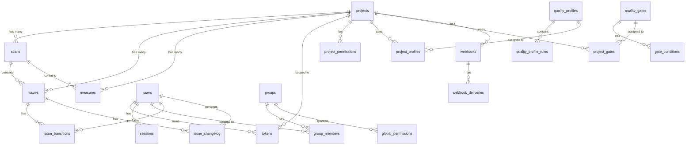

# Database Schema

Ollanta uses **PostgreSQL 17** as its primary data store. The schema is managed by 26 sequential migrations in `ollantastore/postgres/migrations/`.

Key design choices:
- **Partitioned `issues` table** — range-partitioned by `created_at` for fast queries on recent scans
- **COPY protocol** for bulk insert of issues and measures (up to 50× faster than INSERT)
- **pgx/v5 connection pool** — configurable per process so API and workers can be sized independently

## Migrations

Schema migrations are embedded in `ollantastore/postgres/migrations/` and are applied under a PostgreSQL advisory lock, so multiple replicas cannot apply the same migration concurrently.

Local development keeps `auto_migrate = true` by default. Production deployments can set `OLLANTA_AUTO_MIGRATE=false` on API and worker roles, then run the dedicated migrator as a deploy job:

```bash
docker compose --profile migrate run --rm ollantamigrate
```

When auto-migration is disabled, API and worker startup verifies that the latest embedded migration is already present in `schema_migrations` and fails fast if the schema is stale.

### PostgreSQL Pool Sizing

Each API or worker pod owns its own `pgxpool`. Size the cluster-wide connection budget by multiplying per-pod pool limits by the maximum replica count of every role:

```text
total_connections = sum(max_replicas(role) * OLLANTA_POSTGRES_MAX_CONNS(role)) + reserved_admin_connections
```

Start conservatively. API pods usually need more concurrent connections than indexer or webhook workers, while scan workers need enough connections for bulk ingest. The runtime supports these settings:

| Variable | Purpose |
|----------|---------|
| `OLLANTA_POSTGRES_MAX_CONNS` | Maximum open connections per process |
| `OLLANTA_POSTGRES_MIN_CONNS` | Warm idle floor per process |
| `OLLANTA_POSTGRES_MAX_CONN_LIFETIME` | Maximum connection age before rotation |
| `OLLANTA_POSTGRES_MAX_CONN_IDLE_TIME` | Maximum idle time before closing a connection |
| `OLLANTA_POSTGRES_HEALTH_CHECK_PERIOD` | Pool health check cadence |

Prometheus metrics expose `ollanta_db_pool_acquired_conns`, `ollanta_db_pool_idle_conns`, `ollanta_db_pool_total_conns`, and `ollanta_db_health` from each role. Alert when acquired connections stay close to max for several minutes or when health drops to `0`.

## Entity Relationship Diagram



## Tables

### Core Analysis Tables

#### `projects`

Central entity representing a codebase being analyzed.

| Column | Type | Constraints | Description |
|--------|------|-------------|-------------|
| `id` | BIGSERIAL | PK | Auto-increment ID |
| `key` | TEXT | UNIQUE, NOT NULL | Unique project identifier (e.g. `my-org/my-repo`) |
| `name` | TEXT | NOT NULL | Display name |
| `description` | TEXT | NOT NULL | |
| `tags` | TEXT[] | NOT NULL | Free-form tags for filtering |
| `created_at` | TIMESTAMPTZ | NOT NULL | |
| `updated_at` | TIMESTAMPTZ | NOT NULL | |

**Indexes:** `idx_projects_key (key)`

---

#### `scans`

One row per scan execution. Stores aggregate counters and quality gate result.

| Column | Type | Constraints | Description |
|--------|------|-------------|-------------|
| `id` | BIGSERIAL | PK | |
| `project_id` | BIGINT | FK → projects, NOT NULL | |
| `version` | TEXT | NOT NULL | Application version string |
| `branch` | TEXT | NOT NULL | Branch analyzed |
| `commit_sha` | TEXT | NOT NULL | Git commit hash |
| `status` | TEXT | NOT NULL | `completed` / etc. |
| `elapsed_ms` | BIGINT | NOT NULL | Scan duration in milliseconds |
| `gate_status` | TEXT | NOT NULL | `OK` / `WARN` / `ERROR` |
| `analysis_date` | TIMESTAMPTZ | NOT NULL | When the analysis ran |
| `created_at` | TIMESTAMPTZ | NOT NULL | When the record was inserted |
| `total_files` | INT | NOT NULL | Files scanned |
| `total_lines` | INT | NOT NULL | Total lines of code |
| `total_ncloc` | INT | NOT NULL | Non-comment lines of code |
| `total_comments` | INT | NOT NULL | Comment lines |
| `total_issues` | INT | NOT NULL | |
| `total_bugs` | INT | NOT NULL | |
| `total_code_smells` | INT | NOT NULL | |
| `total_vulnerabilities` | INT | NOT NULL | |
| `new_issues` | INT | NOT NULL | Issues new since previous scan |
| `closed_issues` | INT | NOT NULL | Issues closed since previous scan |

**Indexes:** `idx_scans_project_date (project_id, analysis_date DESC)`

---

#### `issues`

Individual findings. **Partitioned by `created_at`** (range partitioning) with a default partition `issues_default`.

| Column | Type | Constraints | Description |
|--------|------|-------------|-------------|
| `id` | BIGSERIAL | PK (composite with `created_at`) | |
| `scan_id` | BIGINT | NOT NULL | FK → scans (not enforced due to partitioning) |
| `project_id` | BIGINT | NOT NULL | FK → projects (not enforced due to partitioning) |
| `rule_key` | TEXT | NOT NULL | Rule that triggered, e.g. `go:no-large-functions` |
| `component_path` | TEXT | NOT NULL | Relative file path |
| `line` | INT | NOT NULL | Start line |
| `column_num` | INT | NOT NULL | Start column |
| `end_line` | INT | NOT NULL | End line |
| `end_column` | INT | NOT NULL | End column |
| `message` | TEXT | NOT NULL | Human-readable description |
| `type` | TEXT | NOT NULL | `bug` / `vulnerability` / `code_smell` / `security_hotspot` |
| `severity` | TEXT | NOT NULL | `blocker` / `critical` / `major` / `minor` / `info` |
| `status` | TEXT | NOT NULL | `open` / `confirmed` / `closed` / `reopened` |
| `resolution` | TEXT | NOT NULL | `fixed` / `wont_fix` / `false_positive` / `confirmed` / empty |
| `tracking_state` | TEXT | NOT NULL | Scope lifecycle: `unknown` / `new` / `unchanged` / `reopened` |
| `effort_minutes` | INT | NOT NULL | Estimated remediation effort |
| `line_hash` | TEXT | NOT NULL | SHA-256 of line content (whitespace-trimmed) for tracking |
| `tags` | TEXT[] | NOT NULL | |
| `engine_id` | TEXT | NOT NULL | `ollanta` or external engine ID |
| `secondary_locations` | JSONB | NOT NULL | Additional code locations |
| `resolved_by` | BIGINT | FK → users | User who resolved the issue |
| `assignee_id` | BIGINT | FK → users | Assigned user |
| `resolved_at` | TIMESTAMPTZ | | When the issue was resolved |
| `created_at` | TIMESTAMPTZ | NOT NULL | Partition key |
| `updated_at` | TIMESTAMPTZ | NOT NULL | |

`quality_domain` and `language` are API/model facets derived from `type`, `tags`, and `component_path`; they are not currently stored as physical columns.

**Indexes:**
- `idx_issues_scan (scan_id)`
- `idx_issues_project (project_id, created_at DESC)`
- `idx_issues_rule (rule_key)`
- `idx_issues_severity (severity)`
- `idx_issues_type (type)`
- `idx_issues_hash (project_id, rule_key, line_hash)` — used for issue tracking across scans

---

#### `measures`

Metric values per scan, either at project level or per file.

| Column | Type | Constraints | Description |
|--------|------|-------------|-------------|
| `id` | BIGSERIAL | PK | |
| `scan_id` | BIGINT | FK → scans, NOT NULL | |
| `project_id` | BIGINT | FK → projects, NOT NULL | |
| `metric_key` | TEXT | NOT NULL | e.g. `ncloc`, `coverage`, `tests`, `mutation_score`, `duplications` |
| `component_path` | TEXT | NOT NULL | File path (empty string = project-level) |
| `value` | DOUBLE PRECISION | NOT NULL | Metric value |
| `created_at` | TIMESTAMPTZ | NOT NULL | |

**Indexes:**
- `idx_measures_scan (scan_id)`
- `idx_measures_project (project_id, metric_key, created_at DESC)`
- `idx_measures_trend (project_id, metric_key, created_at)` — for trend queries

---

#### `issue_transitions`

Status change history for issues (e.g. open → resolved).

| Column | Type | Constraints | Description |
|--------|------|-------------|-------------|
| `id` | BIGSERIAL | PK | |
| `issue_id` | BIGINT | NOT NULL | |
| `user_id` | BIGINT | FK → users, NOT NULL | Who made the change |
| `from_status` | TEXT | NOT NULL | Previous status |
| `to_status` | TEXT | NOT NULL | New status |
| `resolution` | TEXT | NOT NULL | Resolution type |
| `comment` | TEXT | NOT NULL | Optional comment |
| `created_at` | TIMESTAMPTZ | NOT NULL | |

**Indexes:** `idx_issue_transitions_issue (issue_id, created_at DESC)`

---

#### `issue_changelog`

Field-level change log for issues (any field, not just status).

| Column | Type | Constraints | Description |
|--------|------|-------------|-------------|
| `id` | BIGSERIAL | PK | |
| `issue_id` | BIGINT | NOT NULL | |
| `user_id` | BIGINT | | Who made the change |
| `field` | TEXT | NOT NULL | Which field changed |
| `old_value` | TEXT | NOT NULL | Previous value |
| `new_value` | TEXT | NOT NULL | New value |
| `created_at` | TIMESTAMPTZ | NOT NULL | |

**Indexes:** `idx_issue_changelog_issue_id (issue_id)`, `idx_issue_changelog_created_at (created_at)`

---

### Identity & Access Control Tables

#### `users`

| Column | Type | Constraints | Description |
|--------|------|-------------|-------------|
| `id` | BIGSERIAL | PK | |
| `login` | TEXT | UNIQUE, NOT NULL | Username |
| `email` | TEXT | UNIQUE, NOT NULL | |
| `name` | TEXT | NOT NULL | Display name |
| `password_hash` | TEXT | NOT NULL | bcrypt hash (empty for OAuth-only users) |
| `avatar_url` | TEXT | NOT NULL | |
| `provider` | TEXT | NOT NULL | `local` / `github` / `gitlab` / `google` |
| `provider_id` | TEXT | NOT NULL | External provider user ID |
| `is_active` | BOOLEAN | NOT NULL | Soft-delete flag |
| `last_login_at` | TIMESTAMPTZ | | |
| `created_at` | TIMESTAMPTZ | NOT NULL | |
| `updated_at` | TIMESTAMPTZ | NOT NULL | |

**Indexes:** `idx_users_email (email)`, `idx_users_provider (provider, provider_id)`

---

#### `groups` / `group_members`

| Column (groups) | Type | Description |
|-----------------|------|-------------|
| `id` | BIGSERIAL | PK |
| `name` | TEXT | UNIQUE name |
| `description` | TEXT | |
| `is_builtin` | BOOLEAN | Built-in groups cannot be deleted |

| Column (group_members) | Type | Description |
|------------------------|------|-------------|
| `group_id` | BIGINT | FK → groups |
| `user_id` | BIGINT | FK → users |

**Built-in groups:** `ollanta-users`, `ollanta-admins`

---

#### `global_permissions` / `project_permissions`

| Column | Type | Description |
|--------|------|-------------|
| `target` | TEXT | `user` or `group` |
| `target_id` | BIGINT | User or group ID |
| `permission` | TEXT | Permission key |
| `project_id` | BIGINT | (project_permissions only) FK → projects |

**Global permissions:** `admin`, `create_project`, `manage_users`, `manage_groups`, `execute_analysis`, `manage_quality_gates`, `browse`

---

#### `tokens`

API tokens (prefixed `olt_`), stored as hashes.

| Column | Type | Description |
|--------|------|-------------|
| `id` | BIGSERIAL | PK |
| `user_id` | BIGINT | FK → users |
| `name` | TEXT | Display name |
| `token_hash` | TEXT | UNIQUE SHA-256 hash |
| `token_type` | TEXT | Token type |
| `project_id` | BIGINT | FK → projects (optional scope) |
| `last_used_at` | TIMESTAMPTZ | |
| `expires_at` | TIMESTAMPTZ | |

---

#### `sessions`

Refresh token sessions for JWT authentication.

| Column | Type | Description |
|--------|------|-------------|
| `id` | BIGSERIAL | PK |
| `user_id` | BIGINT | FK → users |
| `refresh_hash` | TEXT | UNIQUE hash of refresh token |
| `user_agent` | TEXT | Browser/client UA |
| `ip_address` | TEXT | Client IP |
| `expires_at` | TIMESTAMPTZ | Expiration (30 days default) |

---

### Quality Configuration Tables

#### `quality_gates` / `gate_conditions`

| Column (quality_gates) | Type | Description |
|------------------------|------|-------------|
| `id` | BIGSERIAL | PK |
| `name` | TEXT | UNIQUE name |
| `is_default` | BOOLEAN | Default gate for new projects |
| `is_builtin` | BOOLEAN | Built-in gates cannot be deleted |
| `small_changeset_lines` | INT | Threshold for small changeset detection |

| Column (gate_conditions) | Type | Description |
|--------------------------|------|-------------|
| `gate_id` | BIGINT | FK → quality_gates |
| `metric` | TEXT | Metric key (e.g. `bugs`, `new_vulnerabilities`) |
| `operator` | TEXT | `GT`, `LT`, `GTE`, `LTE`, `EQ`, `NE` |
| `threshold` | NUMERIC | Threshold value |
| `on_new_code` | BOOLEAN | Apply only to new code period |

**Built-in gate:** "Ollanta Default" with conditions: `bugs > 0`, `vulnerabilities > 0`, `new_bugs > 0`, `new_vulnerabilities > 0`

---

#### `quality_profiles` / `quality_profile_rules`

| Column (quality_profiles) | Type | Description |
|--------------------------|------|-------------|
| `id` | BIGSERIAL | PK |
| `name` | TEXT | Profile name |
| `language` | TEXT | Target language |
| `parent_id` | BIGINT | FK → quality_profiles (inheritance) |
| `is_default` | BOOLEAN | Default profile for this language |
| `is_builtin` | BOOLEAN | |

| Column (quality_profile_rules) | Type | Description |
|-------------------------------|------|-------------|
| `profile_id` | BIGINT | FK → quality_profiles |
| `rule_key` | TEXT | Rule key (e.g. `go:no-large-functions`) |
| `severity` | TEXT | Override severity |
| `params` | JSONB | Override rule parameters |

**Built-in profiles:** "Ollanta Way" for `go`, `python`, `javascript`, `typescript`, `rust`

---

#### `project_profiles` / `project_gates`

Join tables assigning profiles and gates to projects.

| Table | Columns | Description |
|-------|---------|-------------|
| `project_profiles` | `project_id`, `language`, `profile_id` | Which profile is active per project+language |
| `project_gates` | `project_id`, `gate_id` | Which gate is active per project |

---

#### `new_code_periods`

Defines how "new code" is determined for quality gate evaluation.

| Column | Type | Description |
|--------|------|-------------|
| `scope` | TEXT | `global`, `project`, or `branch` |
| `project_id` | BIGINT | FK → projects (NULL for global) |
| `branch` | TEXT | Branch name (NULL for project/global) |
| `strategy` | TEXT | `previous_version`, `number_of_days`, `specific_analysis`, `reference_branch`, `auto` |
| `value` | TEXT | Strategy parameter |

**Precedence:** branch > project > global

---

### Integration Tables

#### `webhooks` / `webhook_deliveries`

| Column (webhooks) | Type | Description |
|-------------------|------|-------------|
| `id` | BIGSERIAL | PK |
| `project_id` | BIGINT | FK → projects (NULL = global webhook) |
| `name` | TEXT | Display name |
| `url` | TEXT | Target URL |
| `secret` | TEXT | HMAC signing secret |
| `events` | TEXT[] | Filter events (empty = all) |
| `enabled` | BOOLEAN | |

| Column (webhook_deliveries) | Type | Description |
|-----------------------------|------|-------------|
| `webhook_id` | BIGINT | FK → webhooks |
| `event` | TEXT | Event type |
| `payload` | JSONB | Full payload sent |
| `response_code` | INT | HTTP response code |
| `response_body` | TEXT | Response body |
| `success` | BOOLEAN | Whether delivery succeeded |
| `attempt` | INT | Retry attempt number |
| `delivered_at` | TIMESTAMPTZ | |

---

## Migration History

| # | Migration | Description |
|---|-----------|-------------|
| 001 | `create_projects` | `projects` table |
| 002 | `create_scans` | `scans` table with aggregate counters |
| 003 | `create_issues` | `issues` partitioned table with indexes |
| 004 | `create_measures` | `measures` table with trend index |
| 005 | `create_users` | `users` table |
| 006 | `create_groups` | `groups`, `group_members`, built-in groups |
| 007 | `create_permissions` | `global_permissions`, `project_permissions`, default ACLs |
| 008 | `create_tokens` | `tokens` table for API tokens |
| 009 | `create_sessions` | `sessions` table for JWT refresh |
| 010 | `seed_admin` | Seed default admin user |
| 011 | `create_quality_profiles` | `quality_profiles`, `quality_profile_rules`, `project_profiles`, built-in profiles |
| 012 | `create_quality_gates` | `quality_gates`, `gate_conditions`, `project_gates`, built-in gate |
| 013 | `create_new_code_periods` | `new_code_periods` with global default |
| 014 | `create_webhooks` | `webhooks`, `webhook_deliveries` |
| 015 | `add_small_changeset` | No-op (column already in 012) |
| 016 | `add_issue_resolution` | `resolved_by`, `assignee_id`, `resolved_at` on issues; `issue_transitions` table |
| 017 | `add_engine_id_secondary_locations` | `engine_id`, `secondary_locations` on issues |
| 018 | `add_issue_changelog` | `updated_at` on issues; `issue_changelog` table |
| 019 | `fix_quality_profiles_languages` | Remove java/csharp profiles, add rust |
| 020 | `create_scan_jobs` | Durable asynchronous scan intake jobs |
| 021 | `create_outbox_jobs` | Durable search-index and webhook delivery jobs |
| 022 | `add_branch_aware_analysis` | Branch and pull request metadata on scans/code snapshots |
| 023 | `add_job_trace_context` | Trace context on durable jobs |
| 024 | `add_issue_tracking_state` | `tracking_state` on issues |
| 025 | `allow_cancelled_jobs` | Cancelled durable job status support |
| 026 | `add_job_idempotency_and_dedupe` | Scan idempotency fields, payload hashes, attempts, and active job dedupe indexes |

## ETL Recommendations

For data warehouse / BI tools (e.g. AWS QuickSight, Apache Superset):

**Fact tables** (high volume, append-mostly):
- `issues` — primary fact table, partitioned by date
- `measures` — metric observations per scan
- `scans` — scan-level aggregates (also serves as a fact table for trend analysis)
- `issue_transitions` — status change events
- `issue_changelog` — field-level change events

**Dimension tables** (low volume, reference data):
- `projects` — project dimension
- `users` — user dimension (**exclude `password_hash`**)
- `quality_gates` + `gate_conditions` — gate configuration
- `quality_profiles` + `quality_profile_rules` — profile configuration

**Exclude from ETL** (operational/sensitive):
- `sessions`, `tokens` — sensitive authentication data
- `webhooks`, `webhook_deliveries` — operational, `payload` JSONB is heavy
- `groups`, `group_members`, `global_permissions`, `project_permissions` — internal IAM
- `new_code_periods`, `project_profiles`, `project_gates` — internal configuration

**Recommended incremental keys:**
- `issues.created_at` — partition key, ideal for incremental ETL
- `scans.analysis_date` — scan timeline
- `measures.created_at` — metric timeline
- `issue_transitions.created_at` — change events
- `issue_changelog.created_at` — audit events

**Sample join for a main dataset:**

```sql
SELECT
    p.key           AS project_key,
    p.name          AS project_name,
    s.branch,
    s.commit_sha,
    s.analysis_date,
    s.gate_status,
    i.rule_key,
    i.type,
    i.severity,
    i.status,
    i.resolution,
    i.component_path,
    i.effort_minutes,
    i.engine_id,
    i.created_at    AS detected_at,
    i.resolved_at
FROM issues i
JOIN scans    s ON s.id = i.scan_id
JOIN projects p ON p.id = i.project_id;
```
